# AWS に届いたデータをグラフにする

AWS IoT Core に届いた SwitchBot の温度・湿度・電池残量を、CloudWatch のグラフ (ダッシュボード) にする手順です。

> **注意**: この手順は、AWS のドキュメントに基づいて書いたもので、**まだ実際には試していません**。コマンドの結果が、ここに書いたものと違うときは、教えてください (文書を直します)。AWS の画面や料金は、変わることがあるので、最新の情報を、確認してください。
>
> Thermo ノードの実機がないので、ノードの温度 (ADC の生値) のグラフは、扱いません (「7. これから」を参照)。

## 1. 構成

```
ゲートウェイ ──MQTT──> AWS IoT Core ──ルール──> CloudWatch メトリクス ──> ダッシュボード (グラフ)
                          thermo/+/switchbot/+      名前空間 Thermo
```

- **ルール**: 届いた MQTT のメッセージを、SQL で絞り込んで、別のサービスに渡す、IoT Core の機能です。
- **CloudWatch メトリクス**: 時間とともに変わる値 (時系列) を、保存する仕組みです。グラフを、そのまま作れます。
- コードを書く必要は、ありません。

### 1.1 この構成にした理由と、制限

| 項目 | 内容 |
|:---|:---|
| よい点 | 設定だけで済む。ダッシュボードが、すぐ使える。アラーム (しきい値で通知) も、同じ仕組みで作れる |
| 保存期間 | 1 分間隔のデータは 15 日、5 分間隔は 63 日、1 時間間隔は 455 日 (古いデータは、粗くなって残る) |
| 制限 | メトリクスの名前は、機器ごとに作る (ルールからは、ディメンションを付けられないため)。機器が増えると、設定が増える |
| 向かないこと | 10 秒ごとの、細かいデータを、そのまま残したいとき (1 分の平均になる)、複雑な集計や、SQL での分析 |

細かいデータや、分析が必要なときは、「7. これから」の別の方法を、検討してください。

## 2. 準備

### 2.1 用語: コンソール、CLI、CloudShell

この文書では、同じ設定を、「コンソール」と「CLI」の、2 つの方法で書いています。どちらか 1 つで、構いません。

| 用語 | 意味 | この文書での使い方 |
|:---|:---|:---|
| **コンソール** (AWS マネジメントコンソール) | ブラウザで開く、AWS の画面 (GUI)。マウスで操作する | 各章の「コンソールで作る場合」(画像付き) |
| **CLI** (AWS CLI) | コマンドで AWS を操作する道具。`aws ...` というコマンド | 各章の `bash` のコマンド |
| **CloudShell** | コンソールの中で開く、ブラウザ上のターミナル。**CLI が、はじめから入っていて、ログイン中のアカウントで、そのまま使える** | CLI のコマンドを、実行する場所の 1 つ |

- CLI は、CloudShell の別名ではありません。CloudShell は、CLI を実行できる場所の 1 つです。ほかに、自分のパソコンに、AWS CLI を入れて、実行する方法もあります (その場合は、アクセスキーなどの、認証の設定が、別に必要です)。
- コンソールで操作できることは、ほとんど、CLI でもできます (逆も同じです)。
- CloudShell は、コンソールの画面の、左下の「CloudShell」(または、上のバーの、ターミナルのアイコン) から、開きます。リージョンは、コンソールで選んでいるリージョンと同じになります。

### 2.2 準備すること

- AWS CLI が、使えること (`aws sts get-caller-identity` で、アカウントが確認できる)。コンソールだけで、設定することもできます (各手順に、コンソールの場所を書きます)。
- ゲートウェイの設定は、[AWS_SETUP.md](AWS_SETUP.md) のとおりで、SwitchBot の値が、`thermo/gateway-01/switchbot/<MAC アドレス>` に、届いていること。
- リージョンは、ゲートウェイと同じにします (例: `ap-northeast-1`)。以降の例の、`REGION` と `ACCOUNT_ID` は、自分の値に置き換えます。

```bash
export AWS_REGION=ap-northeast-1
```

## 3. IoT Core が CloudWatch に書き込むための権限 (IAM ロール)

ルールは、このロールを使って、CloudWatch にメトリクスを書き込みます。

```bash
# 信頼ポリシー: IoT Core が、このロールを使える
cat > trust.json <<'JSON'
{
  "Version": "2012-10-17",
  "Statement": [
    {
      "Effect": "Allow",
      "Principal": { "Service": "iot.amazonaws.com" },
      "Action": "sts:AssumeRole"
    }
  ]
}
JSON

# 権限ポリシー: 名前空間 Thermo のメトリクスだけを書き込める
cat > perm.json <<'JSON'
{
  "Version": "2012-10-17",
  "Statement": [
    {
      "Effect": "Allow",
      "Action": "cloudwatch:PutMetricData",
      "Resource": "*",
      "Condition": {
        "StringEquals": { "cloudwatch:namespace": "Thermo" }
      }
    }
  ]
}
JSON

aws iam create-role --role-name thermo-iot-cloudwatch \
  --assume-role-policy-document file://trust.json
aws iam put-role-policy --role-name thermo-iot-cloudwatch \
  --policy-name put-metric --policy-document file://perm.json
```

出力の `Role.Arn` (`arn:aws:iam::ACCOUNT_ID:role/thermo-iot-cloudwatch`) を、次の手順で使います。

### 3.1 コンソールで作る場合

CLI を使わずに、AWS コンソールで、同じロールを作る手順です (画面は、2026 年 10 月のものです。変わることがあります)。

> 画像は、アカウント ID と、ブラウザのブックマークを、塗りつぶしてあります。クリックすると、元の大きさで開きます。

#### 手順 1: 信頼されたエンティティを選ぶ

「IAM → ロール → ロールを作成」を開きます。

**「AWS のサービス」の「IoT」を選ばないでください。** 選ぶと、次の 3 つの管理ポリシー (`AWSIoTLogging`、`AWSIoTRuleActions`、`AWSIoTThingsRegistration`) が、自動で付きます。外せず、このシステムに要らない権限 (S3、SNS、ログなど、アカウント全体への書き込み) も、含まれます。

<a href="assets/aws-iam-01-iot-default-policies.png"></a>

代わりに、「**カスタム信頼ポリシー**」を選びます。入力欄に、上の `trust.json` の中身を貼り付けて、「次へ」を押します。

<a href="assets/aws-iam-02-custom-trust-policy.png"></a>

#### 手順 2: 許可を追加する (何も選ばない)

「許可を追加」の画面です。**ポリシーは、何も選ばずに**、「次へ」を押します。

画面の「許可ポリシー」が、`(3/1223)` のように、3 つ選ばれた状態で、表示されることがあります (手順 1 の途中で、「IoT」を選んでから、「カスタム信頼ポリシー」に変えたときなど)。その場合は、一覧の見出しのチェックボックスを、押して、**選択を、すべて外します** (`(0/1223)` にします)。

<a href="assets/aws-iam-03-permissions-step.png"></a>

#### 手順 3: 名前を付けて作成する

ロール名を `thermo-iot-cloudwatch` にして、画面の下の「ロールを作成」を押します。

<a href="assets/aws-iam-04-role-name.png"></a>

ロールの一覧に、`thermo-iot-cloudwatch` (信頼されたエンティティ: `AWS のサービス: iot`) が、できます。

<a href="assets/aws-iam-05-role-created.png"></a>

#### 手順 4: インラインポリシーを追加する

作ったロールを開いて、「許可」のタブの「許可を追加」から、「インラインポリシーを作成」を選びます。

<a href="assets/aws-iam-06-add-inline-policy.png"></a>

「ポリシーエディタ」の「JSON」のタブに、上の `perm.json` の中身を貼り付けて、「次へ」を押します。

<a href="assets/aws-iam-07-policy-json.png"></a>

ポリシー名を `put-metric` にします。「このポリシーで定義されている許可」に、「CloudWatch / 制限あり: 書き込み / すべてのリソース / `cloudwatch:namespace = Thermo`」と出ていることを確認して、「ポリシーの作成」を押します。

<a href="assets/aws-iam-08-policy-name.png"></a>

#### 手順 5: ARN を控える

ロールの画面の「概要」の「ARN」(`arn:aws:iam::<アカウント ID>:role/thermo-iot-cloudwatch`) を、控えます。4.3 の `roleArn` に使います。

「許可ポリシー」には、`put-metric` (カスタマーインライン) だけがあれば、よいです。

<a href="assets/aws-iam-09-role-arn.png"></a>

#### 手順 1 で「IoT」を選んでしまった場合

次の 3 つの管理ポリシーが、付いたままになっています。ロールの画面の「許可」のタブで、この 3 つを選んで、「削除」(ロールから外す。ポリシー自体は、消えません) を押してください。

- `AWSIoTLogging`
- `AWSIoTRuleActions`
- `AWSIoTThingsRegistration`

`put-metric` だけを、残します。

## 4. ルールを作る

### 4.1 受け取る値

SwitchBot のメッセージ ([AWS_SETUP.md](AWS_SETUP.md) の 1.2) は、次の形です。

```json
{"node":"ED:2E:C4:46:3B:11","type":"switchbot","temperature_c":21.8,"humidity":54,"battery":100,"uptime_ms":223966,"timestamp":1791338131}
```

ルールの SQL で、`temperature_c`、`humidity`、`battery` を取り出して、それぞれ別のメトリクスにします。

### 4.2 メトリクスの名前

CloudWatch のメトリクスは、「名前空間」(`Thermo`) と「メトリクス名」で決まります。ルールからは、ディメンション (機器を区別する付加情報) を付けられないので、**機器の MAC アドレスを、メトリクス名に入れます**。

| メトリクス名 | 意味 |
|:---|:---|
| `ED:2E:C4:46:3B:11_temperature_c` | 温度 [℃] |
| `ED:2E:C4:46:3B:11_humidity` | 湿度 [%] |
| `ED:2E:C4:46:3B:11_battery` | 電池残量 [%] |

MAC アドレスは、トピックの 4 番目の要素 (`thermo/gateway-01/switchbot/ED:2E:...`) です。ルールでは、`${topic(4)}` で取り出します。

### 4.3 ルールを作る

```bash
cat > rule.json <<'JSON'
{
  "sql": "SELECT temperature_c, humidity, battery FROM 'thermo/+/switchbot/+'",
  "awsIotSqlVersion": "2016-03-23",
  "ruleDisabled": false,
  "actions": [
    {
      "cloudwatchMetric": {
        "roleArn": "arn:aws:iam::ACCOUNT_ID:role/thermo-iot-cloudwatch",
        "metricNamespace": "Thermo",
        "metricName": "${topic(4)}_temperature_c",
        "metricValue": "${temperature_c}",
        "metricUnit": "None"
      }
    },
    {
      "cloudwatchMetric": {
        "roleArn": "arn:aws:iam::ACCOUNT_ID:role/thermo-iot-cloudwatch",
        "metricNamespace": "Thermo",
        "metricName": "${topic(4)}_humidity",
        "metricValue": "${humidity}",
        "metricUnit": "Percent"
      }
    },
    {
      "cloudwatchMetric": {
        "roleArn": "arn:aws:iam::ACCOUNT_ID:role/thermo-iot-cloudwatch",
        "metricNamespace": "Thermo",
        "metricName": "${topic(4)}_battery",
        "metricValue": "${battery}",
        "metricUnit": "Percent"
      }
    }
  ]
}
JSON

aws iot create-topic-rule --rule-name thermo_switchbot_to_cloudwatch \
  --topic-rule-payload file://rule.json
```

- `ACCOUNT_ID` は、自分のアカウント ID に置き換えます。
- `'thermo/+/switchbot/+'` の `+` は、1 つの階層に合う、ワイルドカードです。ゲートウェイの ID (`gateway-01`) と、SwitchBot の MAC アドレスの、どれにも合います。
- `metricTimestamp` を指定しないと、メッセージを受け取った時刻が、使われます (ゲートウェイの時刻 `timestamp` は、SNTP が合っていないと、入らないので、使いません)。
- 電池残量が、わからないとき (`battery` を出力しないとき) は、その値のルールは、実行されず、`battery` のメトリクスだけが、欠けます。
### 4.4 コンソールで作る場合

画面は、2026 年 10 月のものです。変わることがあります。画像は、クリックすると、元の大きさで開きます。

#### 手順 1: ルールのプロパティ

「IoT Core → メッセージのルーティング → ルール」を開いて、「ルールを作成」を押します。リージョンが、`アジアパシフィック (東京)` になっていることを、確認してください。

<a href="assets/aws-rule-01-rule-list.png"></a>

ルール名を `thermo_switchbot_to_cloudwatch` にします (英数字とアンダースコアだけ。スペースとハイフンは、使えません)。説明 (例: `SwitchBot の値を CloudWatch のメトリクスにする`) は、空でも構いません。タグは、不要です。「次へ」を押します。

<a href="assets/aws-rule-02-properties.png"></a>

#### 手順 2: SQL ステートメント

SQL のバージョンは、`2016-03-23` にします。SQL ステートメントに、次の 1 行を入れて、「次へ」を押します。

```sql
SELECT temperature_c, humidity, battery FROM 'thermo/+/switchbot/+'
```

<a href="assets/aws-rule-03-sql.png"></a>

ブラウザの入力欄に貼ると、シングルクォート (`'`) が、全角に変わることがあります。変わったときは、半角で、入力し直してください。

#### 手順 3: ルールアクション

アクションを、3 つ追加します。どれも、アクションの種類は、「**CloudWatch metric**」(CloudWatch メトリクスにメッセージデータを送信) です。入力欄は、次のとおりです。

| 入力欄 | アクション 1 (温度) | アクション 2 (湿度) | アクション 3 (電池) |
|:---|:---|:---|:---|
| メトリクス名 | `${topic(4)}_temperature_c` | `${topic(4)}_humidity` | `${topic(4)}_battery` |
| メトリクス名前空間 | `Thermo` | `Thermo` | `Thermo` |
| 単位 | `None` | `Percent` | `Percent` |
| 値 | `${temperature_c}` | `${humidity}` | `${battery}` |
| タイムスタンプ (オプション) | 空 | 空 | 空 |
| IAM ロール | `thermo-iot-cloudwatch` | 同じ | 同じ |

- `${...}` は、そのまま入力します。メッセージが届いたときに、値に置き換わります。
- **メトリクス名の前後に、空白を入れないでください。** 先頭に空白が入ると、`" ED:2E:C4:46:3B:11_humidity"` のように、空白付きの名前のメトリクスが、できてしまいます (貼り付けのときに、入りやすいです)。直すときは、ルールのアクションの、メトリクス名を編集します。
- IAM ロールは、プルダウンから選びます (3 章で作ったロール)。

<a href="assets/aws-rule-04-action.png"></a>

アクション 1 の画面です。上に、手順 2 の SQL が、表示されています。アクション 2 と 3 も、同じように、追加して、「次へ」を押します。

#### 手順 4: 確認と作成

手順 1 から 3 の内容 (ルール名、SQL、3 つのアクション) を、確認して、画面の下の「作成」を押します。

<a href="assets/aws-rule-05-review.png"></a>

#### 手順 5: 作成できたことの確認

「ルール `thermo_switchbot_to_cloudwatch` は正常に作成されました。」と出て、次のようになっていれば、完了です。

- ステータス: **アクティブ**
- トピック: `thermo/+/switchbot/+`
- アクション (3): `CloudWatch metric` が 3 つ

<a href="assets/aws-rule-06-created.png"></a>

次は、5 章で、データが届いているか、確認します。

## 5. データが届いているか確認する

1. ゲートウェイを起動して、1〜2 分待ちます (`Connected to AWS IoT Core` が、ログに出ていること)。
2. 次のコマンドで、メトリクスができたか確認します。

   ```bash
   aws cloudwatch list-metrics --namespace Thermo
   ```

   `ED:2E:C4:46:3B:11_temperature_c` など、3 つのメトリクスが、出るはずです (最初の値から、数分かかることがあります)。

3. 直近の値を見ます。

   ```bash
   aws cloudwatch get-metric-statistics --namespace Thermo \
     --metric-name "ED:2E:C4:46:3B:11_temperature_c" \
     --start-time "$(date -u -d '30 minutes ago' +%Y-%m-%dT%H:%M:%SZ)" \
     --end-time "$(date -u +%Y-%m-%dT%H:%M:%SZ)" \
     --period 300 --statistics Average
   ```

- コンソール: 「CloudWatch → メトリクス → すべてのメトリクス」で、名前空間 `Thermo` を選びます。

## 6. グラフ (ダッシュボード) を作る

### 6.1 コンソールで作る

画面は、2026 年 10 月のものです。変わることがあります。画像は、クリックすると、元の大きさで開きます。

#### 手順 1: ダッシュボードを作る

「CloudWatch → ダッシュボード」を開きます。リージョンが、`アジアパシフィック (東京)` になっていることを、確認してください。「ダッシュボードの作成」を押します。

<a href="assets/aws-dash-01-list.png"></a>

ダッシュボード名を `thermo` にして、「ダッシュボードの作成」を押します (名前に使えるのは、英数字、ハイフン、アンダースコアです)。

<a href="assets/aws-dash-02-name.png"></a>

#### 手順 2: ウィジェット (グラフ) を追加する

「ウィジェットの追加」の画面が出ます。データソースタイプは「Cloudwatch」、データ型は「メトリクス」、ウィジェットのタイプは「**線**」を選んで、「次へ」を押します。

<a href="assets/aws-dash-03-widget-type.png"></a>

#### 手順 3: メトリクスを選ぶ

「メトリクスグラフの追加」の画面です。「カスタム名前空間」の「**Thermo**」を押して、「ディメンションなしのメトリクス」を押すと、メトリクスの一覧が出ます。

<a href="assets/aws-dash-04-metrics.png"></a>

一覧には、`ED:2E:C4:46:3B:11_humidity` が、**2 つ**出ることがあります。メトリクス名の先頭に、空白が入っていた古いもの (一覧の最初の行) と、空白のない新しいものです (8 章を参照)。**空白のないほうを選びます** (古いものは、新しい値が入りません)。

1 つ目のウィジェットは、湿度 (`ED:2E:C4:46:3B:11_humidity`) の、チェックボックスを押します。グラフが、画面の上に、出ます。「ウィジェットの作成」を押します。

<a href="assets/aws-dash-05-humidity.png"></a>

温度 (`ED:2E:C4:46:3B:11_temperature_c`)、電池残量 (`ED:2E:C4:46:3B:11_battery`) も、同じように、1 つずつ、ウィジェットにします (画面の右上の「+」で、ウィジェットを追加します)。温度と湿度は、単位が違うので、別のウィジェットにします。

#### 手順 4: 保存する

3 つのウィジェットが、並びます。画面の右上に「**自動保存: オフ**」と出ています。右上の橙色の「**保存**」ボタンを押してください。押さないと、画面を閉じたときに、ダッシュボードが消えます。

<a href="assets/aws-dash-06-three-widgets.png"></a>

#### 手順 5: 期間と統計を変える (必要なときだけ)

何も変えなければ、**統計は「平均 (Average)」、期間は「5 分」**です。今回は、このままで構いません。変えるときは、ウィジェットごとに、次のようにします。

1. ウィジェット右上の「⋮」を押して、「編集」を選びます。
2. 「グラフの編集」の画面で、「**グラフ化したメトリクス**」のタブを開きます。
3. 次のどちらかで、変えます。
   - **メトリクスの行の「統計」と「期間」**: その 1 つのメトリクスだけが、変わります。プルダウンで、`平均`、`最小`、`最大`、`合計` などと、`1 分`、`5 分`、`1 時間` などを、選びます。
   - **画面の右上の「統計:」と「期間:」**: ウィジェットの、すべてのメトリクスに、まとめて、適用します。
4. 画面の右下の「**ウィジェットの更新**」を押します。

<a href="assets/aws-dash-08-edit-period-stat.png"></a>

- 期間の最小は、1 分です。ゲートウェイは、10 秒ごとに送りますが、CloudWatch は、期間の中の値を、まとめます (平均なら、5 分の平均)。
- 温度のゆらぎを、細かく見たいときは、期間を「1 分」にします。電池残量のように、ゆっくり変わるものは、「1 時間」で、十分です。

**画面全体の表示範囲と時刻**

ダッシュボードの右上の、`1時間` `3時間` `12時間` `1日` `3日` `1週` のボタンで、表示する時間の範囲を、変えます。すぐ右の「UTC タイムゾーン」を、「**ローカルタイムゾーン**」に変えると、時刻が、日本時間 (UTC+09:00) で、表示されます。

<a href="assets/aws-dash-07-dashboard-local-time.png"></a>

右上に、「自動保存」の表示があります。「オフ」のときは、変更のたびに、「保存」を押します。「オン」にすると、変更が、自動で、保存されます。

### 6.2 CLI で作る

```bash
cat > dashboard.json <<'JSON'
{
  "widgets": [
    {
      "type": "metric", "x": 0, "y": 0, "width": 12, "height": 6,
      "properties": {
        "title": "Temperature [C]",
        "region": "ap-northeast-1",
        "metrics": [ [ "Thermo", "ED:2E:C4:46:3B:11_temperature_c" ] ],
        "stat": "Average", "period": 300, "view": "timeSeries"
      }
    },
    {
      "type": "metric", "x": 12, "y": 0, "width": 12, "height": 6,
      "properties": {
        "title": "Humidity [%]",
        "region": "ap-northeast-1",
        "metrics": [ [ "Thermo", "ED:2E:C4:46:3B:11_humidity" ] ],
        "stat": "Average", "period": 300, "view": "timeSeries"
      }
    },
    {
      "type": "metric", "x": 0, "y": 6, "width": 12, "height": 6,
      "properties": {
        "title": "Battery [%]",
        "region": "ap-northeast-1",
        "metrics": [ [ "Thermo", "ED:2E:C4:46:3B:11_battery" ] ],
        "stat": "Average", "period": 3600, "view": "timeSeries"
      }
    }
  ]
}
JSON

aws cloudwatch put-dashboard --dashboard-name thermo \
  --dashboard-body file://dashboard.json
```

- 機器 (MAC アドレス) を足すときは、`metrics` に、`[ "Thermo", "<MAC>_temperature_c" ]` の行を足します。ルールは、変えなくて済みます (`+` で、すべての機器に合うため)。
- `period` は、秒です。10 秒ごとに届いても、CloudWatch は、1 分の単位で、集計します (最小は 60)。

## 7. これから

### 7.1 アラーム: 温度が 30 ℃ を超えたら、メールで通知する

CloudWatch の「アラーム」は、メトリクスの値が、しきい値を超えたときに、通知を送る仕組みです。ここでは、`ED:2E:C4:46:3B:11_temperature_c` の、5 分の平均が **30 ℃ を超えたら、メールを送る**例を、説明します。

> **コンソールの手順は、画面で確認しました** (画像は、アカウント ID、メールアドレスを塗りつぶしてあります。クリックすると、元の大きさで開きます)。**CLI の手順は、まだ、確認していません**。メールアドレスは、`you@example.com` と書いてあります。自分のものに、置き換えてください。

構成は、次のとおりです。

```
メトリクス (温度) ──> アラーム (30 ℃ を超えたら ALARM) ──> SNS トピック ──> メール
```

- **SNS** (Simple Notification Service): 通知を、メールなどに、配る仕組みです。「トピック」(通知の宛先のまとまり) を作って、メールアドレスを「サブスクリプション」(購読) として、登録します。
- アラームの状態は、`OK` (しきい値の範囲内)、`ALARM` (しきい値を超えた)、`データ不足` (値が、まだ届いていない) の 3 つです。状態が変わったときに、通知が、届きます。

#### 手順 1: SNS のトピックを作って、メールを登録する

**CLI の場合** (CloudShell など)

```bash
# トピックを作る (出力の TopicArn を控える)
aws sns create-topic --name thermo-alarm

# メールアドレスを登録する (TopicArn は、上の出力の値)
aws sns subscribe \
  --topic-arn arn:aws:sns:ap-northeast-1:ACCOUNT_ID:thermo-alarm \
  --protocol email \
  --notification-endpoint you@example.com
```

**コンソールの場合**

1. 画面上部の検索欄に「**SNS**」と入力して、「Simple Notification Service」を開きます。リージョンは、東京です。トップ画面の「トピック名」に `thermo-alarm` を入力して、「次のステップ」を押します。

<a href="assets/aws-sns-01-top.png">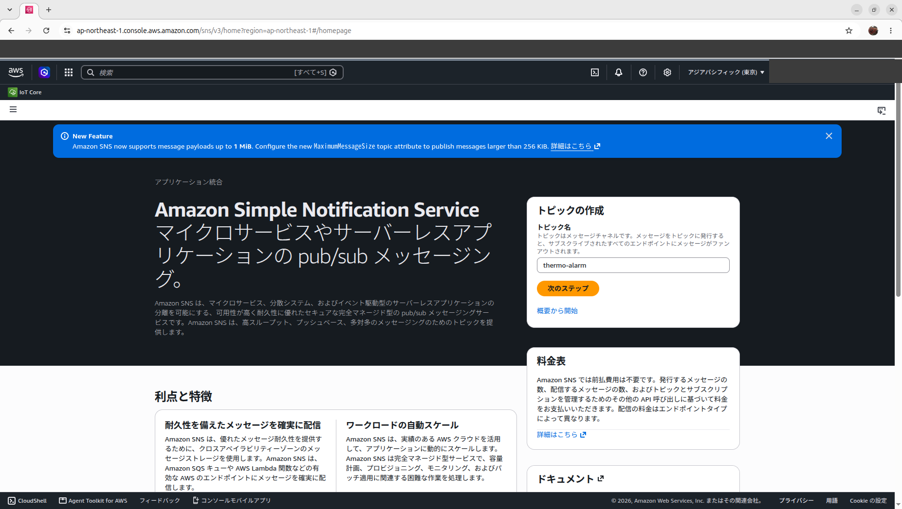</a>

2. 「トピックの作成」の画面です。タイプは「**スタンダード**」、名前は `thermo-alarm` のまま、ほかは既定の値で、画面の下の「トピックの作成」を押します。

<a href="assets/aws-sns-02-create-topic.png">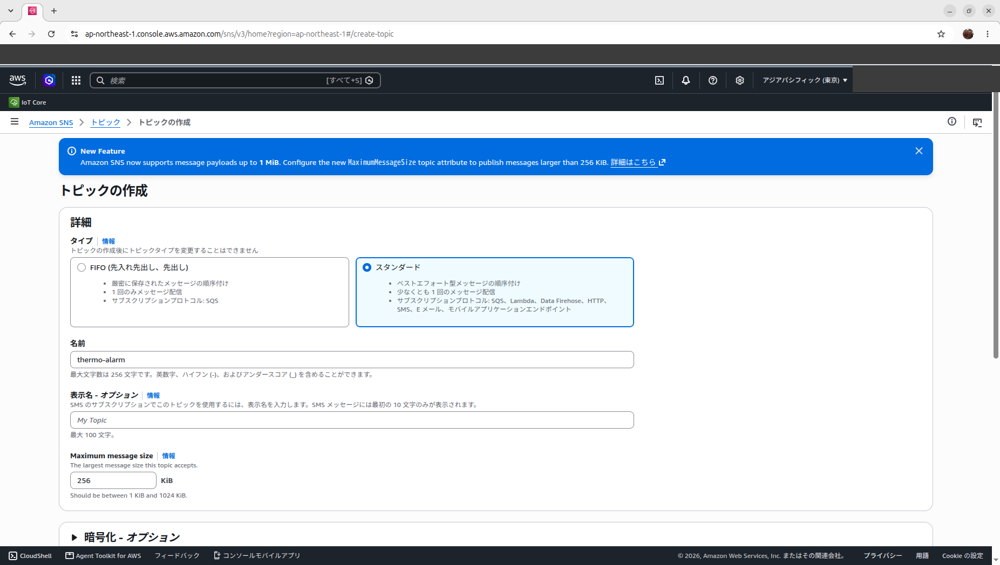</a>

3. トピックができます。「サブスクリプション」のタブの「**サブスクリプションの作成**」を押します。

<a href="assets/aws-sns-03-topic-created.png">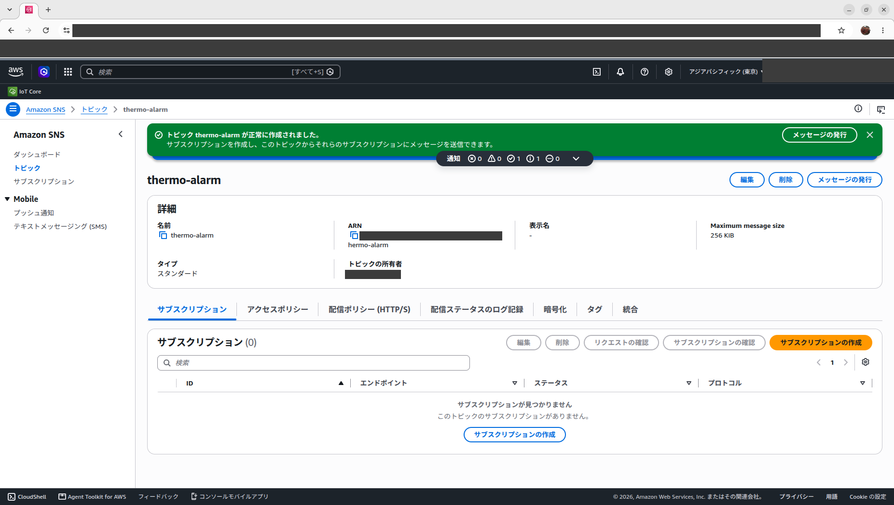</a>

4. 「トピック ARN」は、そのままです。プロトコルは「**E メール**」、エンドポイントに、通知を受け取る自分のメールアドレスを入れて、画面の下の「サブスクリプションの作成」を押します。

<a href="assets/aws-sns-04-create-subscription.png">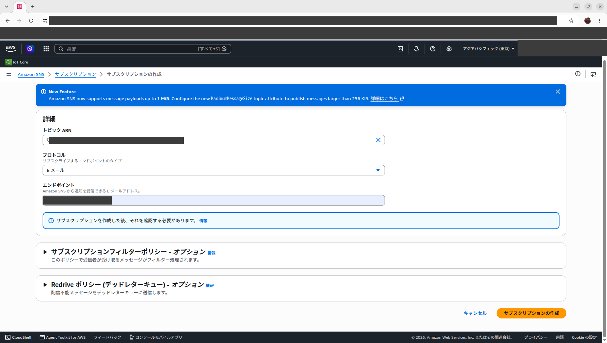</a>

5. サブスクリプションができます。ステータスは「**保留中の確認**」です。このままでは、通知は、届きません。次の「確認」を行ってください。

<a href="assets/aws-sns-05-pending.png">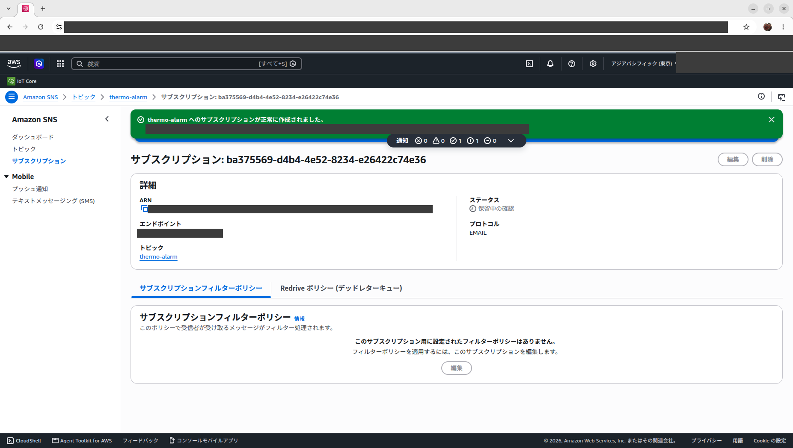</a>

**どちらの場合も、確認が必要です。** 登録したメールアドレスに、件名「AWS Notification - Subscription Confirmation」のメールが届きます。**メールの中の「Confirm subscription」(購読を承認) を押してください**。押さないと、通知が、届きません (迷惑メールのフォルダも、確認してください)。承認すると、SNS の画面の、サブスクリプションの状態が、「確認済み」になります。

<a href="assets/aws-sns-06-confirmed.png">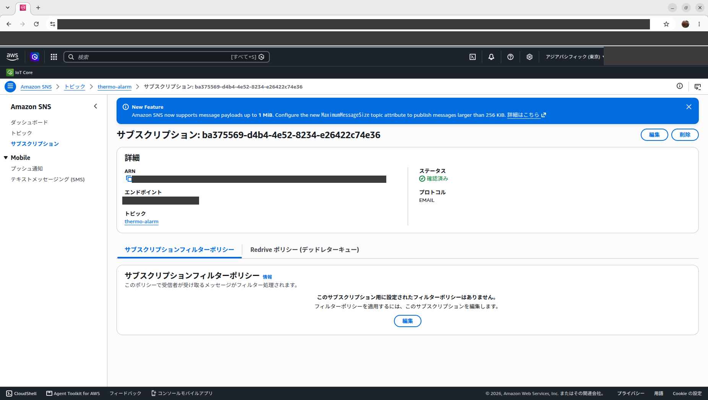</a>


#### 手順 2: アラームを作る

**CLI の場合**

```bash
aws cloudwatch put-metric-alarm \
  --alarm-name thermo-temperature-high \
  --alarm-description "The temperature of the SwitchBot is higher than 30 C" \
  --namespace Thermo \
  --metric-name "ED:2E:C4:46:3B:11_temperature_c" \
  --statistic Average --period 300 \
  --evaluation-periods 1 --datapoints-to-alarm 1 \
  --threshold 30 --comparison-operator GreaterThanThreshold \
  --treat-missing-data notBreaching \
  --alarm-actions arn:aws:sns:ap-northeast-1:ACCOUNT_ID:thermo-alarm \
  --ok-actions arn:aws:sns:ap-northeast-1:ACCOUNT_ID:thermo-alarm
```

| オプション | 意味 |
|:---|:---|
| `--statistic Average --period 300` | 5 分 (300 秒) の平均を、評価する |
| `--evaluation-periods 1 --datapoints-to-alarm 1` | 5 分の平均が、1 回でも、しきい値を超えたら、ALARM にする。誤報を減らしたいときは、`--evaluation-periods 3 --datapoints-to-alarm 3` (15 分続いたら) のようにする |
| `--threshold 30 --comparison-operator GreaterThanThreshold` | 30 ℃ **より大きい**とき |
| `--treat-missing-data notBreaching` | データが来ないときは、しきい値を超えていないと、みなす (ALARM にしない) |
| `--alarm-actions` | ALARM になったときに、通知する SNS トピック |
| `--ok-actions` | ALARM から OK に、戻ったときに、通知する (省略すると、戻りの通知は、来ない) |

**コンソールの場合**

1. 「CloudWatch → アラーム」を開いて、「アラームの作成」を押します。

<a href="assets/aws-alarm-01-list-empty.png">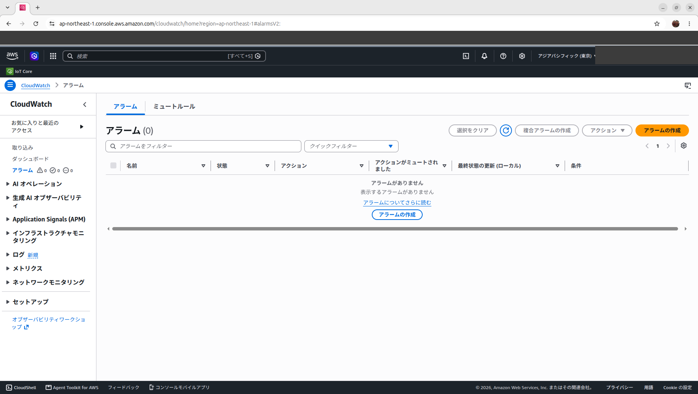</a>

2. 「メトリクスと条件の指定」の画面です。データソースは「メトリクス」、タイプは「クラシック」のまま、「**メトリクスの選択**」を押します。

<a href="assets/aws-alarm-02-create.png">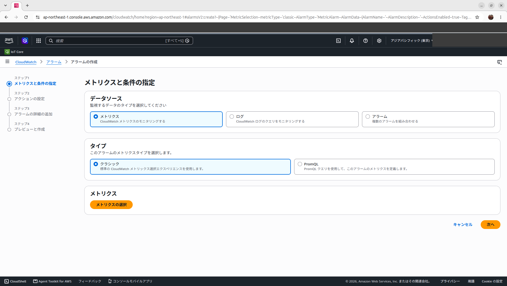</a>

3. 「カスタム名前空間」の「**Thermo**」を押して、「ディメンションなしのメトリクス」を押します。

<a href="assets/aws-alarm-03-select-metric.png">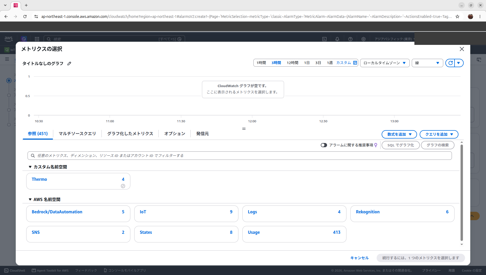</a>

4. 一覧から、`ED:2E:C4:46:3B:11_temperature_c` の、チェックボックスを押して、画面の右下の「メトリクスの選択」を押します (ダッシュボードのグラフを作ったときと、同じ選び方です)。

<a href="assets/aws-alarm-04-metric-picked.png">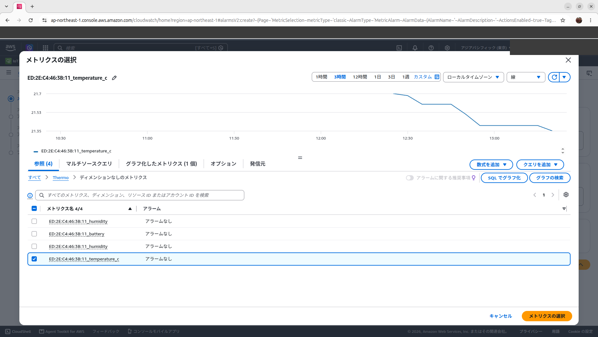</a>

5. 統計は「**平均値**」、期間は「**5 分**」にします。右の「条件」で、しきい値の種類は「**静的**」、条件は「**より大きい**」、「... よりも」に `30` を入れます。下のプレビューに、30 の赤い線が、出ます。

<a href="assets/aws-alarm-05-threshold.png">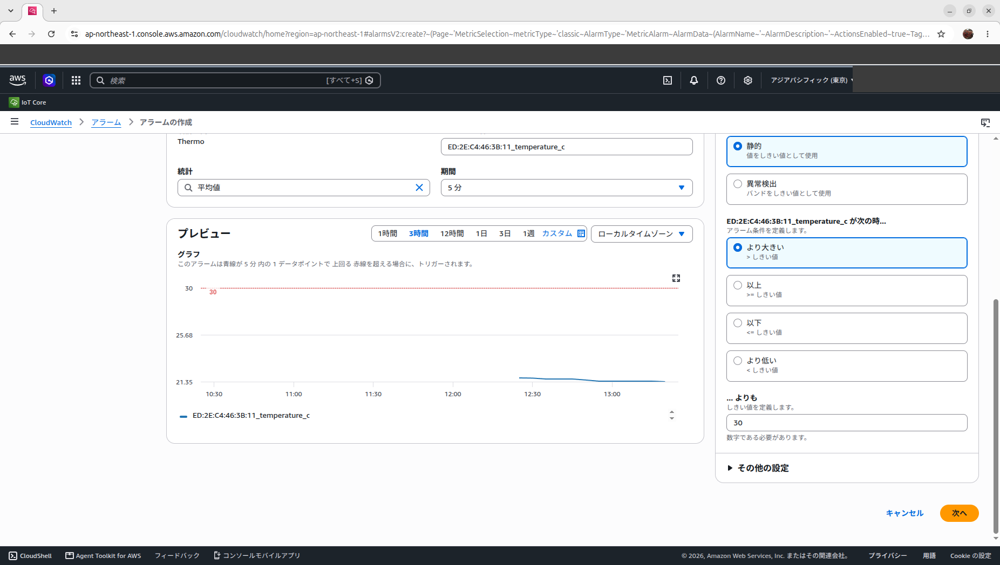</a>

6. 画面の下の「**その他の設定**」を開きます。「アラームを実行するデータポイント」は `1 / 1`、「欠落データの処理」は「**欠落データを適正 (しきい値を超えていない) として処理**」にします。「次へ」を押します。

<a href="assets/aws-alarm-06-other-settings.png">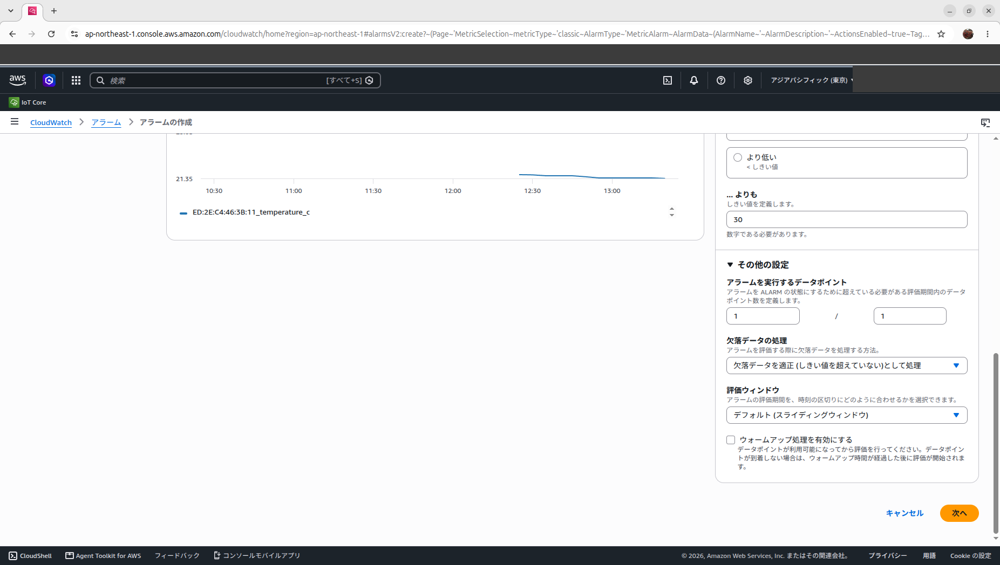</a>

7. 「アクションの設定」の画面です。アラーム状態トリガーは「**アラーム状態**」、「次の SNS トピックに通知を送信」は「**既存の SNS トピックを選択**」にして、「通知の送信先」に `thermo-alarm` を選びます。選ぶと、登録したメールアドレスが、出ます。「次へ」を押します。

<a href="assets/aws-alarm-07-actions.png">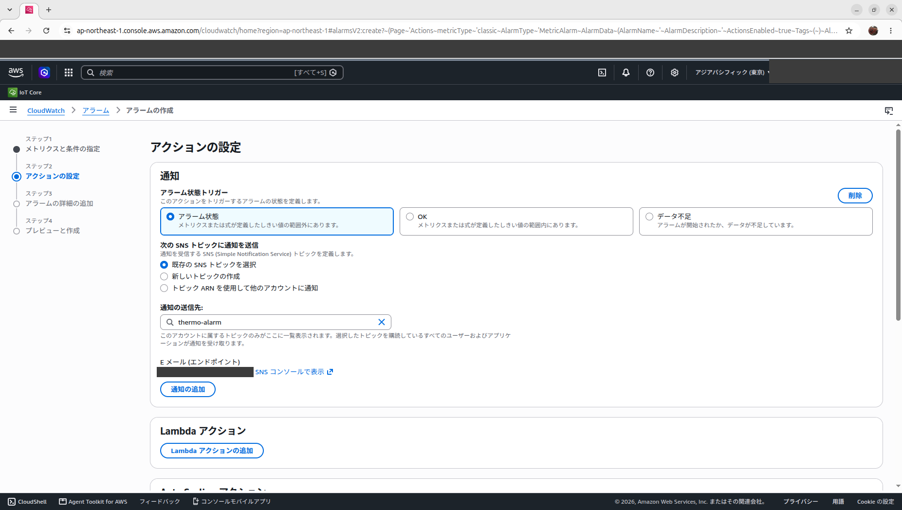</a>

8. アラーム名に `thermo-temperature-high` を入れて、「次へ」を押します (説明は、空で構いません)。

<a href="assets/aws-alarm-08-name.png">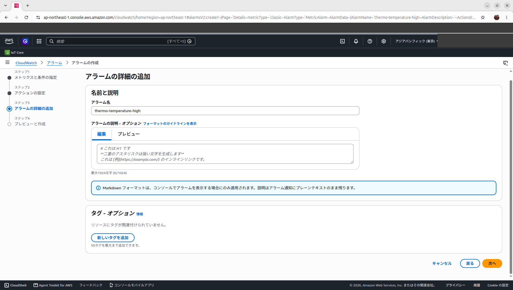</a>

9. 「プレビューと作成」で、メトリクス (`ED:2E:C4:46:3B:11_temperature_c`、平均値、5 分)、条件 (30 より大きい)、データポイント (1 / 1)、アクション (`thermo-alarm` に通知) を確認して、画面の下の「**アラームの作成**」を押します。

<a href="assets/aws-alarm-09-review.png">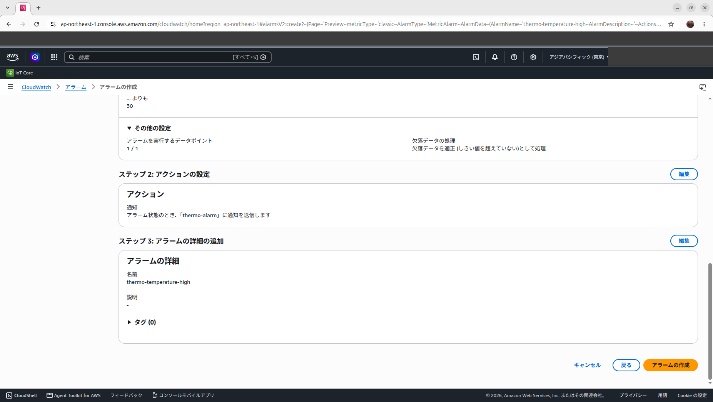</a>

10. アラームが、できます。作った直後の状態は「**データ不足**」です。数分たつと、「OK」(30 ℃ 以下) に、変わります。

<a href="assets/aws-alarm-10-created.png">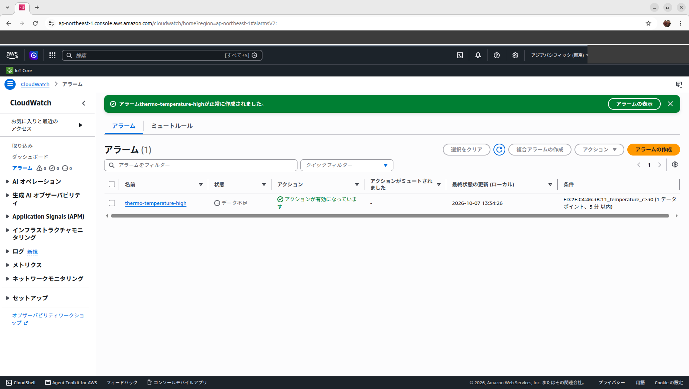</a>

- 「アラーム状態トリガー」を、1 つしか選んでいないので、`OK` に戻ったときの通知は、届きません。戻りも通知したいときは、7 の画面の「通知の追加」を押して、トリガーを「OK」にして、同じトピックを選びます (CLI の `--ok-actions` と同じです)。

#### 手順 3: 通知を試す

30 ℃ まで、温度を上げなくても、アラームの状態を、手で、ALARM にして、メールが届くか、試せます。

```bash
aws cloudwatch set-alarm-state \
  --alarm-name thermo-temperature-high \
  --state-value ALARM --state-reason "test"
```

- 数秒から数分で、件名「ALARM: "thermo-temperature-high" in Asia Pacific (Tokyo)」のメールが、届きます。

<a href="assets/aws-alarm-11-mail.png">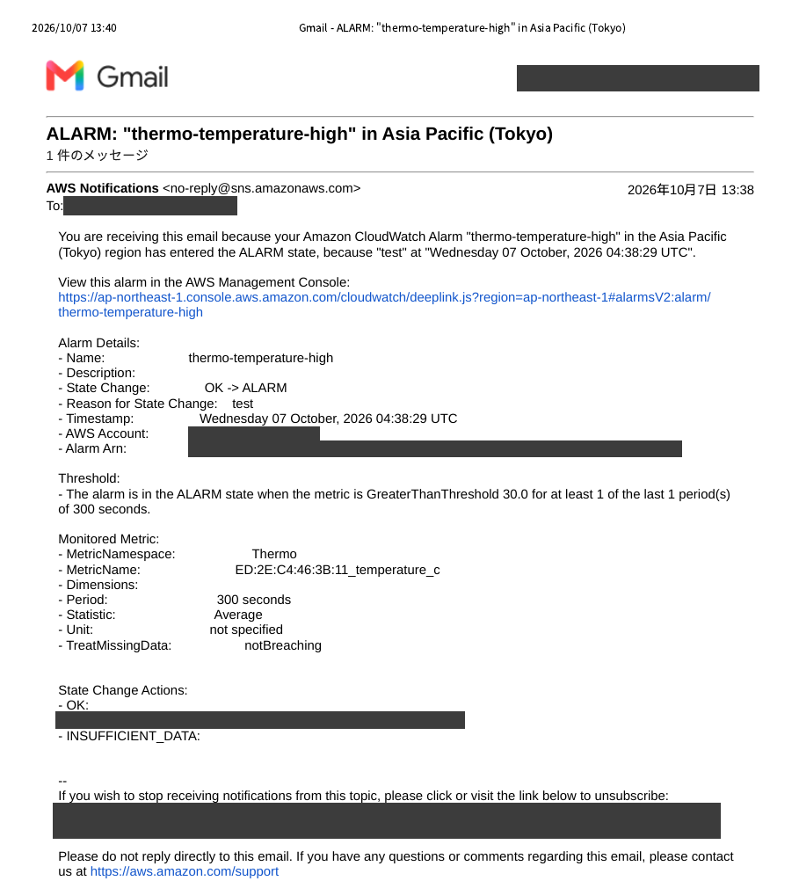</a>

メールには、次のことが、書いてあります (上の画像は、実際に届いたメールです)。

| 項目 | 内容 |
|:---|:---|
| `State Change` | `OK -> ALARM` (状態が、OK から ALARM に、変わった) |
| `Reason for State Change` | `test` (`--state-reason` に書いた文字) |
| `Threshold` | `GreaterThanThreshold 30.0` を、300 秒の期間の中で、1 回 (しきい値より、大きいとき) |
| `Monitored Metric` | 名前空間 `Thermo`、メトリクス `ED:2E:C4:46:3B:11_temperature_c`、平均、300 秒、`TreatMissingData: notBreaching` |
| `State Change Actions` | `ALARM` のときだけ、`thermo-alarm` に通知 (`OK` は、空) |

> **このメールを、人に見せたり、公開したりしないでください。** アカウント ID と、**購読を解除するリンク** (メールの末尾) が、入っています。リンクを知っている人は、通知の購読を、解除できます。この文書の画像は、これらを塗りつぶしてあります。
- 状態は、次の評価 (最長 5 分) で、実際の値に、戻ります。戻ると、`OK` のメールが、来ます (`--ok-actions` を付けたとき)。
- コンソールでは、アラームの画面の「アクション」→「テスト」(または、状態の変更) で、同じことができます。

アラームの状態は、「CloudWatch → アラーム」で、見られます。ダッシュボードに、アラームの状態を、載せることもできます (ウィジェットの追加で、データ型「アラーム」を選びます)。

#### 変えるとき

| やりたいこと | 変える場所 |
|:---|:---|
| 寒いとき (例: 5 ℃ を下回ったら) | `--threshold 5 --comparison-operator LessThanThreshold` |
| ゲートウェイが止まったこと (データが来ない) | `--treat-missing-data breaching` にして、`--period 300 --evaluation-periods 3` のようにする (15 分、データが来ないと、ALARM) |
| 電池残量が少ないとき | メトリクス `ED:2E:C4:46:3B:11_battery`、`--threshold 20 --comparison-operator LessThanThreshold`、`--period 3600` |
| 通知を止める | アラームを削除する (`aws cloudwatch delete-alarms --alarm-names thermo-temperature-high`)、または、アクションを無効にする (`aws cloudwatch disable-alarm-actions --alarm-names thermo-temperature-high`) |
| 送り先を増やす | SNS のトピックに、メールアドレスを、もう 1 つ登録する (手順 1)。登録した人は、それぞれ、承認が必要 |

料金は、アラーム 1 つあたり月に数十円以下、メールの通知は、月 1,000 件まで無料の目安です (リージョンと時期で、変わります。最新の料金表で、確認してください)。

### 7.2 Thermo ノードの温度

ノードの値は、`temperature_c` と `humidity` (DHT11 のとき) です ([AWS_SETUP.md](AWS_SETUP.md) の 1.1)。トピックは、`thermo/CLIENT_ID/NODE_ADDRESS/temperature` なので、SwitchBot のルール (4 章) の SQL の、`FROM` を、`thermo/+/+/temperature` にした、別のルールを作ると、同じ手順で、グラフにできます (メトリクス名の、`${topic(4)}` の位置は、同じ 4 番目のアドレスです)。ノードの実機で、値が届くのを確認していないので、この手順では、詳しくは、扱いません。

### 7.3 細かいデータを残す・分析する

| 方法 | 向いていること |
|:---|:---|
| IoT ルール → S3 (JSON) → Athena | 10 秒ごとの、すべてのデータを、安く残して、SQL で分析する |
| IoT ルール → DynamoDB | 最新の値を、すぐ読み出す。ほかのアプリから使う |
| Amazon Managed Grafana (+ CloudWatch) | 見た目や、複数のデータの組み合わせを、自由に作る |

### 7.4 ダッシュボードを、ほかの人に見せる (共有)

作ったダッシュボードは、**AWS にログインできる人だけ**が見られます。URL を知られても、ログインが必要です。ほかの人にも見せたいときは、ダッシュボードを「共有」します。

> 共有の選び方の画面は、確認しました。共有を始めたあとの画面 (リンクの表示など) は、まだ確認していません。

#### 共有の開き方

「CloudWatch → ダッシュボード」で、ダッシュボード (`thermo`) を開いて、右上の「**アクション**」→「**ダッシュボードの共有**」を押します。共有の方法が、3 つ、出ます。

<a href="assets/aws-share-01-options.png">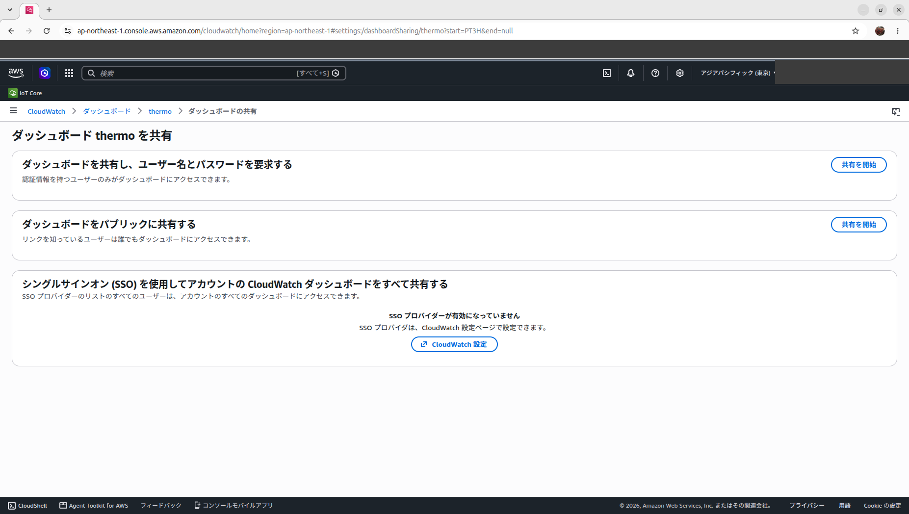</a>

| 方法 | 見られる人 | 注意 |
|:---|:---|:---|
| ダッシュボードを共有し、ユーザー名とパスワードを要求する | 認証情報を持つ人だけ | 家族などに見せるには、こちらが安全 (この画面は、確認していません) |
| ダッシュボードを**パブリックに共有する** | **リンクを知っている人は、誰でも** | 下の警告を、よく読む |
| シングルサインオン (SSO) で、アカウントの CloudWatch ダッシュボードを、すべて共有する | SSO プロバイダーの、すべてのユーザー | SSO の設定が、別に必要。小さな家庭用には、向かない |

#### パブリックに共有する場合の警告

「パブリックに共有する」の「共有を開始」を押すと、黄色い警告が、出ます。

<a href="assets/aws-share-02-public-warning.png">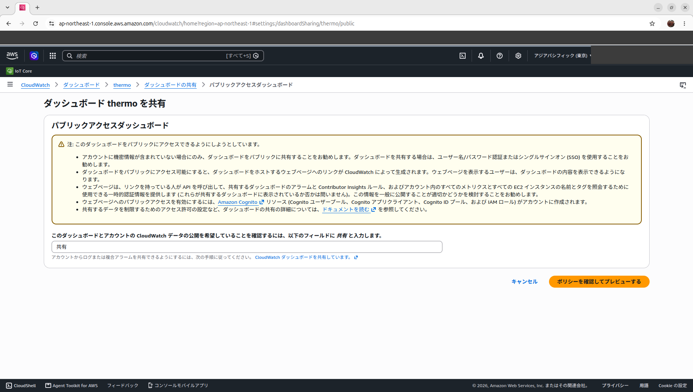</a>

警告の要点は、次のとおりです。

- アカウントに**機密情報が含まれていない場合にだけ**、公開を勧める。
- リンクを持っている人は、API を呼び出して、共有するダッシュボードのアラームなどだけでなく、**アカウント内のすべてのメトリクスと、すべての EC2 インスタンスの名前とタグ**を、照会できる一時的な認証情報を、受け取る (共有するダッシュボードに、表示されているかどうかは、関係がない)。
- 公開のために、Amazon Cognito のリソース (ユーザープール、ID プール、IAM ロール) が、アカウントに作られる。

**家族に、室温を見せたいだけなら、公開は、おすすめしません。** グラフに映る情報 (温度、湿度、電池残量、MAC アドレス) の外にも、アカウントのメトリクスの名前が、見えてしまうためです。

#### 公開の手順 (公開してよいと、決めたとき)

1. 上の画面で、確認の入力欄に「**共有**」と入力して、「ポリシーを確認してプレビューする」を押します。
2. 「ダッシュボード共有ポリシーを受け入れる」の画面で、作られるポリシーを確認して、「**ポリシーを受け入れ、共有可能なリンクを生成する**」を押します。

<a href="assets/aws-share-03-accept-policy.png">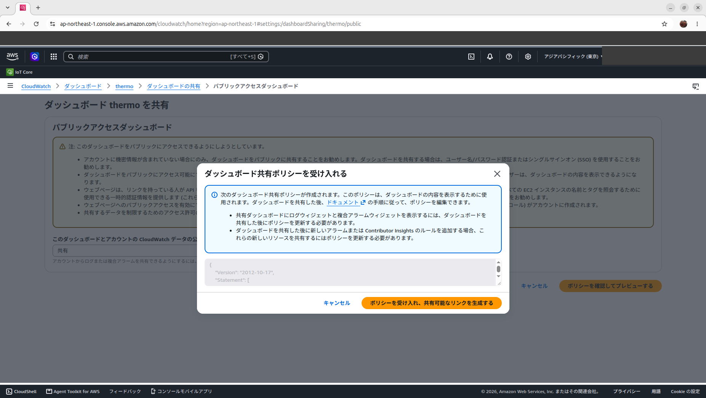</a>

3. 「ダッシュボードの共有」の画面の、「ダッシュボードをパブリックに共有する」の欄に、**共有可能なリンク (URL)** が、表示されます。「リンクをクリップボードにコピー」で、リンクを、コピーできます。あとから見るときも、「アクション → ダッシュボードの共有」の、同じ欄です。

<a href="assets/aws-share-04-shared.png">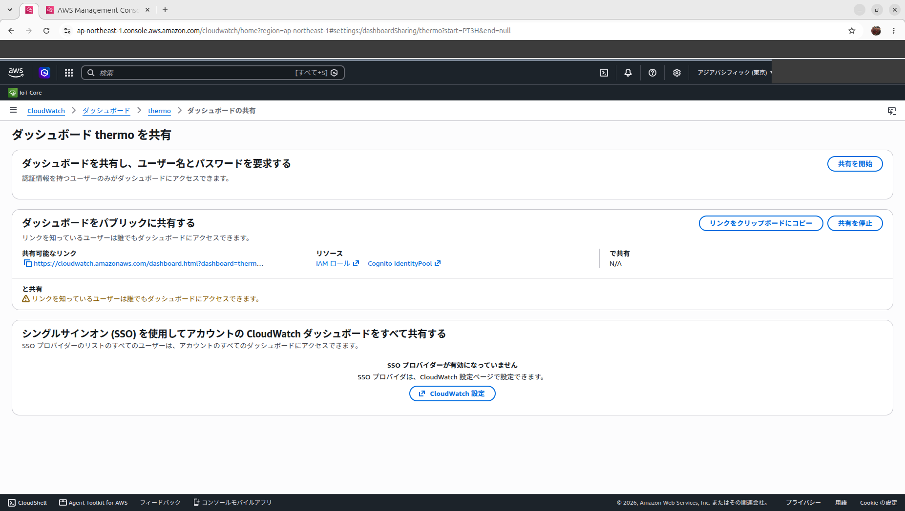</a>

リンクを、ブラウザで開くと、ログインなしで、ダッシュボードが、見られます (画面は、英語です。`Light` / `Dark` の切り替えがあります)。

> **リンクの中には、アカウント ID が入っています** (リンクの `context=` の部分を、解読すると分かります)。リンクを人に伝えると、アカウント ID も、一緒に伝わります。

#### 「認証情報を受け取ります」とは

警告にある「認証情報」は、AWS を操作するための、**一時的な鍵** (アクセスキー、シークレットキー、セッショントークン。約 1 時間で期限が切れる) のことです。ログインしていない人にも、グラフを見せるために、AWS が、次のように動きます。

1. 誰かが、公開のリンクを開く。
2. 画面は、Amazon Cognito に、ログインしていない人用の、一時的な鍵を、要求する。
3. Cognito は、公開のために作られた IAM ロール (`CWDBSharing-PublicReadOnlyAccess-...`) の権限を持つ鍵を、渡す。
4. 画面は、その鍵で、CloudWatch の API を呼び出して、グラフのデータを取って、表示する。

つまり、**リンクを開いた人のブラウザが、あなたのアカウントの、読み取り専用の権限を、一時的に持ちます**。書き込みや削除は、できません。ただし、ダッシュボードに載っていないものも、読み取れます (警告にある、すべてのメトリクスの名前、すべての EC2 インスタンスの名前とタグ、アラームなど)。

- 公開のために作られる Cognito のリソースは、リンクの内容から、**バージニア北部 (`us-east-1`) に作られる**ことが分かります (東京ではありません)。
- 「ダッシュボードの共有」の画面の「リソース」の、「IAM ロール」と「Cognito IdentityPool」のリンクから、作られたリソースを、確認できます。

#### 共有をやめる

「ダッシュボードの共有」の画面の、「ダッシュボードをパブリックに共有する」の欄の右上の「**共有を停止**」を押します。停止すると、公開のリンクは、使えなくなります。

- 停止したあと、同じ画面を開き直して、この欄が、「共有を開始」の状態 (リンクが、表示されない) に、戻っていることを、確認してください (停止後の画面は、まだ確認していません)。
- 公開のために作られた IAM ロール (`CWDBSharing-PublicReadOnlyAccess-...`) と、Cognito のリソースが、停止後も、残ることがあります。残っていて、不要なら、IAM のロールの画面と、Cognito (バージニア北部) の画面で、削除します (削除の画面は、確認していません)。

#### ユーザー名とパスワードで共有する

「ダッシュボードを共有し、ユーザー名とパスワードを要求する」の方式です。**登録したメールアドレスの人だけ**が、見られます (最大 5 人)。「リンクを知っている人は、誰でも」の公開より、安全です。

1. 「ダッシュボードの共有」の画面で、「ダッシュボードを共有し、ユーザー名とパスワードを要求する」の「共有を開始」を押します。
2. 「E メールアドレスを追加」の欄に、見せたい人のメールアドレスを入れます (複数のときは、カンマかセミコロンで区切ります。最大 5 つ)。入れると、メールアドレスが、枠で囲まれて、並びます。「ポリシーを確認してプレビューする」を押します。

<a href="assets/aws-share-05-email-user.png">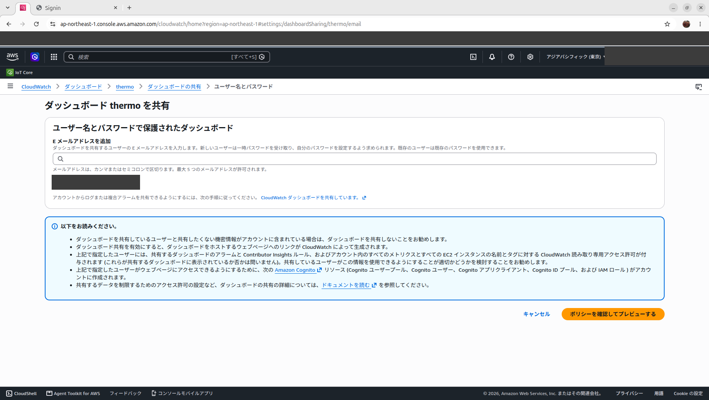</a>

   画面の青い枠に、公開のときと同じ種類の警告が、出ています (登録した人に、アカウント内のすべてのメトリクスと、EC2 の名前とタグの、読み取り専用の権限が付く)。
3. 「ダッシュボード共有ポリシーを受け入れる」の画面で、「ポリシーを受け入れ、共有可能なリンクを生成する」を押します。

<a href="assets/aws-share-06-email-user-policy.png">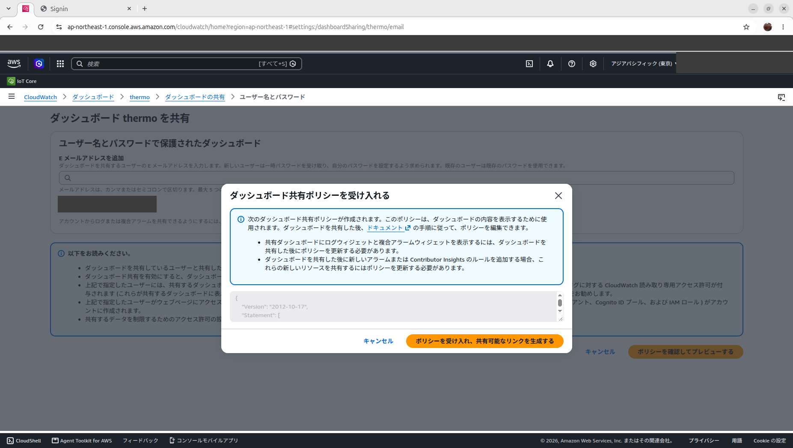</a>

4. 「ダッシュボード thermo は正常に共有されました。」と出ます。「**リンクをコピー**」で、共有のリンクを、コピーできます (「新しいタブで開く」で、開けます)。右上に「共有済み」と出ます。

<a href="assets/aws-share-07-shared.png">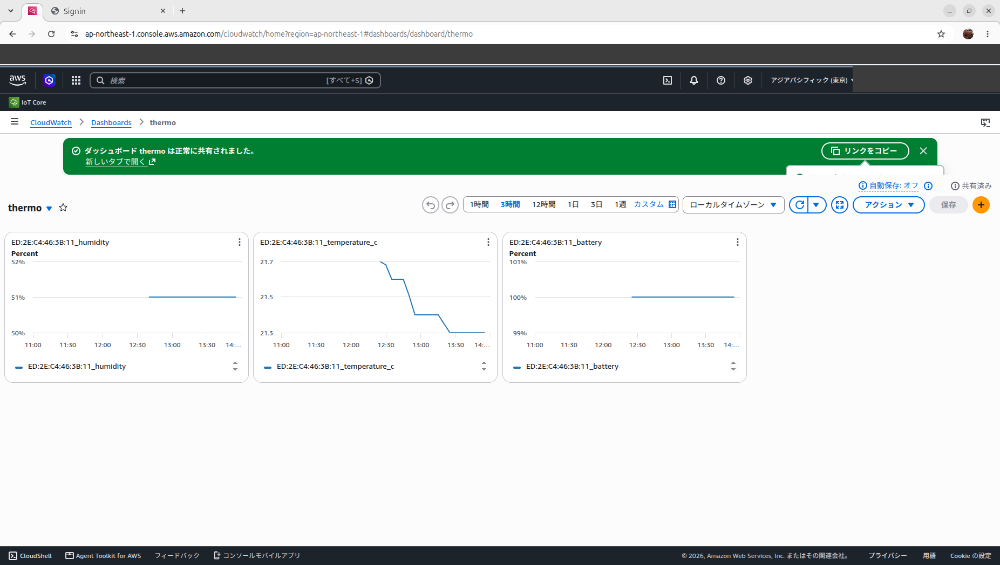</a>

5. 共有を受ける人は、リンクを開くと、ログイン画面 (Amazon Cognito) が出ます。

<a href="assets/aws-share-08-sign-in.png">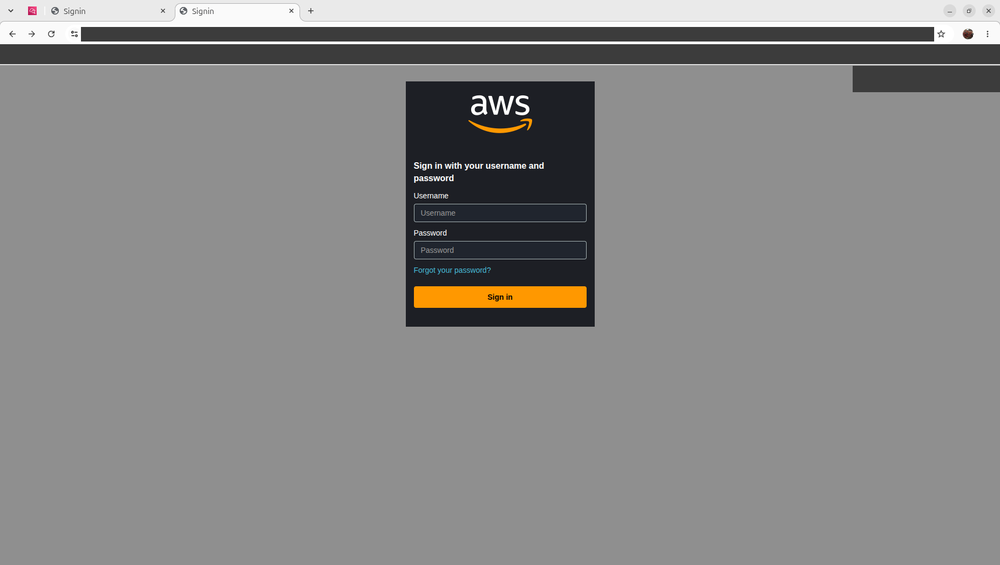</a>

   - **Username**: 共有の画面で入れた、**メールアドレス**。
   - **Password**: 初回は、そのメールアドレスに届く、AWS からの招待メールの**一時パスワード**。入力して `Sign in` を押すと、新しいパスワードを決める画面が出ます。決めたパスワードが、2 回目以降の、パスワードです。
   - これは、**AWS アカウントの、ログインではありません**。共有のために作られた、ビューア用のユーザー (Cognito のユーザー) です。

**6.** ログインすると、ダッシュボードが見られます (画面は、英語です。`Light` / `Dark` の切り替え、時間の範囲、`UTC timezone` の切り替えがあります)。

<a href="assets/aws-share-09-viewer.png">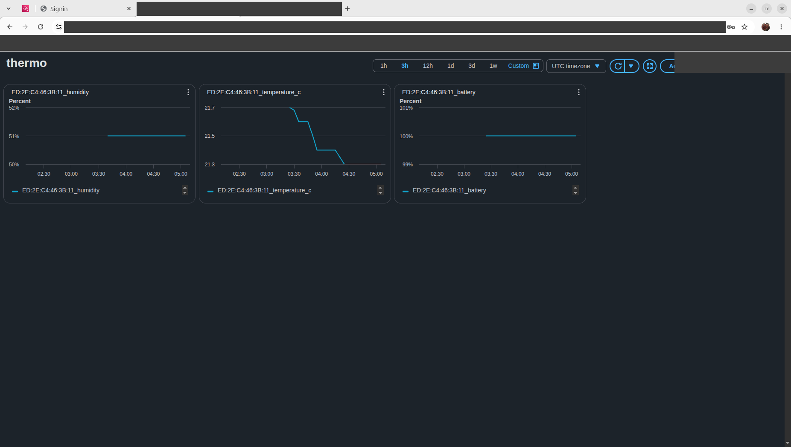</a>

> ログイン画面の URL (`cw-db-<アカウント ID>.auth.us-east-1.amazoncognito.com`) と、ダッシュボードの URL (`context=` の部分) には、アカウント ID が入っています。招待メールの文面は、確認していません。パスワードを忘れたときの方法も、確認していません。

#### ユーザーを追加する、共有をやめる

「アクション → ダッシュボードの共有」の画面の、「ダッシュボードを共有し、ユーザー名とパスワードを要求する」の欄に、共有中の、リンクと、メールアドレス (「(1) と共有」) が、出ます。

<a href="assets/aws-share-10-manage.png">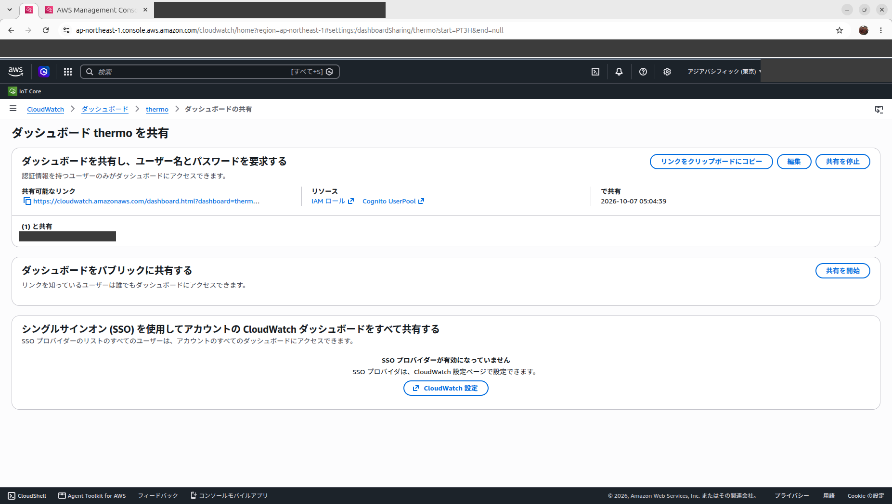</a>

| ボタン | 内容 |
|:---|:---|
| リンクをクリップボードにコピー | 共有のリンクを、コピーする |
| **編集** | 共有する人の**メールアドレスを、追加、または削除する** (最大 5 つ)。追加したアドレスには、招待メールが届く (編集の画面は、確認していません) |
| 共有を停止 | この方式の共有を、やめる |

- 同じ画面の「リソース」に、共有のために作られた、IAM ロールと、Cognito UserPool (バージニア北部) への、リンクがあります。
- 「パブリックに共有する」の欄が、「共有を開始」の状態なら、公開は、止まっています。


## 8. うまくいかないとき

| 症状 | 確認すること |
|:---|:---|
| メトリクスが、できない | MQTT テストクライアントで、`thermo/#` に、メッセージが届いているか。ルールの SQL のトピック (`thermo/+/switchbot/+`) が、合っているか |
| `list-metrics` が、空 | 数分待つ。リージョンが、ルールを作ったところと、同じか (`--region` を付ける) |
| ルールが、動かない | 「IoT Core → ルール」で、ルールが「有効」か。「IoT Core → 設定 → ログ」で、ログを有効にして、CloudWatch Logs の `AWSIotLogsV2` で、エラーを確認する |
| 権限のエラー (`AccessDenied`) | ロールの信頼ポリシーが、`iot.amazonaws.com` か。権限ポリシーの名前空間が、`Thermo` か |
| アラームのメールが、届かない | SNS のサブスクリプションが「確認済み」か (確認メールの承認)。迷惑メールのフォルダ。アラームの「アクション」に、`thermo-alarm` が入っているか。リージョンが、東京か |
| アラームの状態が、ずっと「データ不足」 | メトリクス名が、正しいか (空白、MAC アドレス)。ゲートウェイが、AWS に送信しているか。ルールが、動いているか (5 章) |
| メトリクス名の先頭に、空白がある (`" ED:..."`) | ルールのアクションの、メトリクス名の先頭の空白を、消す (4.4 の手順 3)。古い名前のメトリクスは、残るが、新しい値は入らなくなる |
| 電池残量だけ、ない | メッセージに、`battery` が入っているか (残量が不明なときは、入りません) |
| 値が、1 分ごとにしか、変わらない | CloudWatch の最小の期間は、1 分です。正常です |

## 9. 料金の目安

料金は、リージョンと時期で変わります。最新の料金表で、確認してください。

- **IoT Core のルール**: メッセージ 1 通で、ルールの実行が 1 回、アクションが 3 回です。10 秒に 1 通だと、1 日に 8,640 通 (アクション約 26,000 回)、1 か月で約 78 万回です。
- **CloudWatch**: カスタムメトリクス 1 つ (機器あたり 3 つ) と、ダッシュボード (3 つまで無料枠) が、対象です。メトリクスは、10 個までが、無料枠です (無料枠の条件は、変わることがあります)。

使わなくなったときは、課金が続かないように、ルール (`aws iot delete-topic-rule --rule-name thermo_switchbot_to_cloudwatch`)、ダッシュボード、アラームを削除してください。
