# AWS に届いたデータをグラフにする

AWS IoT Core に届いた SwitchBot の温度・湿度・電池残量を、CloudWatch のグラフ (ダッシュボード) にする手順です。

> **注意**: この手順は、AWS のドキュメントに基づいて書いたもので、**まだ実際には試していません**。コマンドの結果が、ここに書いたものと違うときは、教えてください (文書を直します)。AWS の画面や料金は、変わることがあるので、最新の情報を、確認してください。
>
> Thermo ノードの実機がないので、ノードの温度 (ADC の生値) のグラフは、扱いません (「7. これから」を参照)。

## 1. 構成

```
ゲートウェイ ──MQTT──> AWS IoT Core ──ルール──> CloudWatch メトリクス ──> ダッシュボード (グラフ)
                          thermo/+/switchbot/+      名前空間 Thermo
```

- **ルール**: 届いた MQTT のメッセージを、SQL で絞り込んで、別のサービスに渡す、IoT Core の機能です。
- **CloudWatch メトリクス**: 時間とともに変わる値 (時系列) を、保存する仕組みです。グラフを、そのまま作れます。
- コードを書く必要は、ありません。

### 1.1 この構成にした理由と、制限

| 項目 | 内容 |
|:---|:---|
| よい点 | 設定だけで済む。ダッシュボードが、すぐ使える。アラーム (しきい値で通知) も、同じ仕組みで作れる |
| 保存期間 | 1 分間隔のデータは 15 日、5 分間隔は 63 日、1 時間間隔は 455 日 (古いデータは、粗くなって残る) |
| 制限 | メトリクスの名前は、機器ごとに作る (ルールからは、ディメンションを付けられないため)。機器が増えると、設定が増える |
| 向かないこと | 10 秒ごとの、細かいデータを、そのまま残したいとき (1 分の平均になる)、複雑な集計や、SQL での分析 |

細かいデータや、分析が必要なときは、「7. これから」の別の方法を、検討してください。

## 2. 準備

### 2.1 用語: コンソール、CLI、CloudShell

この文書では、同じ設定を、「コンソール」と「CLI」の、2 つの方法で書いています。どちらか 1 つで、構いません。

| 用語 | 意味 | この文書での使い方 |
|:---|:---|:---|
| **コンソール** (AWS マネジメントコンソール) | ブラウザで開く、AWS の画面 (GUI)。マウスで操作する | 各章の「コンソールで作る場合」(画像付き) |
| **CLI** (AWS CLI) | コマンドで AWS を操作する道具。`aws ...` というコマンド | 各章の `bash` のコマンド |
| **CloudShell** | コンソールの中で開く、ブラウザ上のターミナル。**CLI が、はじめから入っていて、ログイン中のアカウントで、そのまま使える** | CLI のコマンドを、実行する場所の 1 つ |

- CLI は、CloudShell の別名ではありません。CloudShell は、CLI を実行できる場所の 1 つです。ほかに、自分のパソコンに、AWS CLI を入れて、実行する方法もあります (その場合は、アクセスキーなどの、認証の設定が、別に必要です)。
- コンソールで操作できることは、ほとんど、CLI でもできます (逆も同じです)。
- CloudShell は、コンソールの画面の、左下の「CloudShell」(または、上のバーの、ターミナルのアイコン) から、開きます。リージョンは、コンソールで選んでいるリージョンと同じになります。

### 2.2 準備すること

- AWS CLI が、使えること (`aws sts get-caller-identity` で、アカウントが確認できる)。コンソールだけで、設定することもできます (各手順に、コンソールの場所を書きます)。
- ゲートウェイの設定は、[AWS_SETUP.md](AWS_SETUP.md) のとおりで、SwitchBot の値が、`thermo/gateway-01/switchbot/<MAC アドレス>` に、届いていること。
- リージョンは、ゲートウェイと同じにします (例: `ap-northeast-1`)。以降の例の、`REGION` と `ACCOUNT_ID` は、自分の値に置き換えます。

```bash
export AWS_REGION=ap-northeast-1
```

## 3. IoT Core が CloudWatch に書き込むための権限 (IAM ロール)

ルールは、このロールを使って、CloudWatch にメトリクスを書き込みます。

```bash
# 信頼ポリシー: IoT Core が、このロールを使える
cat > trust.json <<'JSON'
{
  "Version": "2012-10-17",
  "Statement": [
    {
      "Effect": "Allow",
      "Principal": { "Service": "iot.amazonaws.com" },
      "Action": "sts:AssumeRole"
    }
  ]
}
JSON

# 権限ポリシー: 名前空間 Thermo のメトリクスだけを書き込める
cat > perm.json <<'JSON'
{
  "Version": "2012-10-17",
  "Statement": [
    {
      "Effect": "Allow",
      "Action": "cloudwatch:PutMetricData",
      "Resource": "*",
      "Condition": {
        "StringEquals": { "cloudwatch:namespace": "Thermo" }
      }
    }
  ]
}
JSON

aws iam create-role --role-name thermo-iot-cloudwatch \
  --assume-role-policy-document file://trust.json
aws iam put-role-policy --role-name thermo-iot-cloudwatch \
  --policy-name put-metric --policy-document file://perm.json
```

出力の `Role.Arn` (`arn:aws:iam::ACCOUNT_ID:role/thermo-iot-cloudwatch`) を、次の手順で使います。

### 3.1 コンソールで作る場合

CLI を使わずに、AWS コンソールで、同じロールを作る手順です (画面は、2026 年 10 月のものです。変わることがあります)。

> 画像は、アカウント ID と、ブラウザのブックマークを、塗りつぶしてあります。クリックすると、元の大きさで開きます。

#### 手順 1: 信頼されたエンティティを選ぶ

「IAM → ロール → ロールを作成」を開きます。

**「AWS のサービス」の「IoT」を選ばないでください。** 選ぶと、次の 3 つの管理ポリシー (`AWSIoTLogging`、`AWSIoTRuleActions`、`AWSIoTThingsRegistration`) が、自動で付きます。外せず、このシステムに要らない権限 (S3、SNS、ログなど、アカウント全体への書き込み) も、含まれます。

<a href="assets/aws-iam-01-iot-default-policies.png">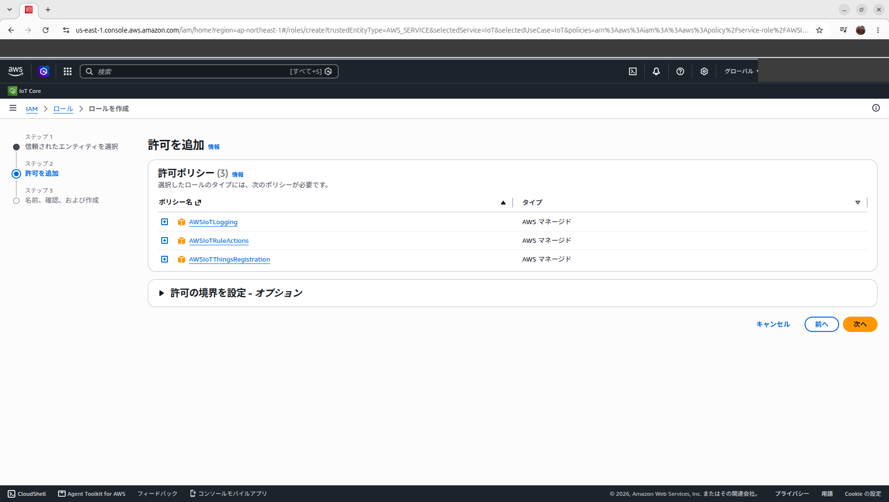</a>

代わりに、「**カスタム信頼ポリシー**」を選びます。入力欄に、上の `trust.json` の中身を貼り付けて、「次へ」を押します。

<a href="assets/aws-iam-02-custom-trust-policy.png">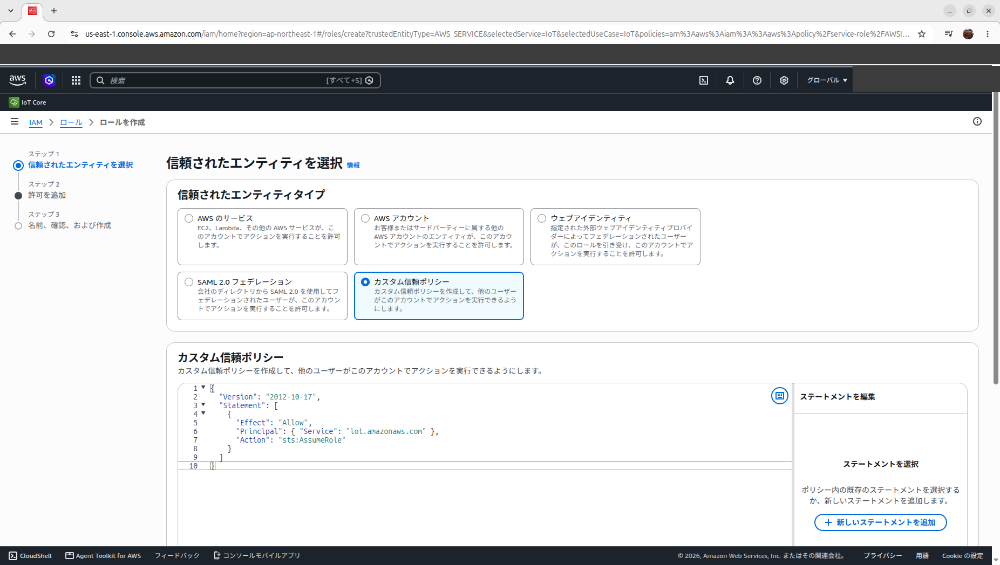</a>

#### 手順 2: 許可を追加する (何も選ばない)

「許可を追加」の画面です。**ポリシーは、何も選ばずに**、「次へ」を押します。

画面の「許可ポリシー」が、`(3/1223)` のように、3 つ選ばれた状態で、表示されることがあります (手順 1 の途中で、「IoT」を選んでから、「カスタム信頼ポリシー」に変えたときなど)。その場合は、一覧の見出しのチェックボックスを、押して、**選択を、すべて外します** (`(0/1223)` にします)。

<a href="assets/aws-iam-03-permissions-step.png">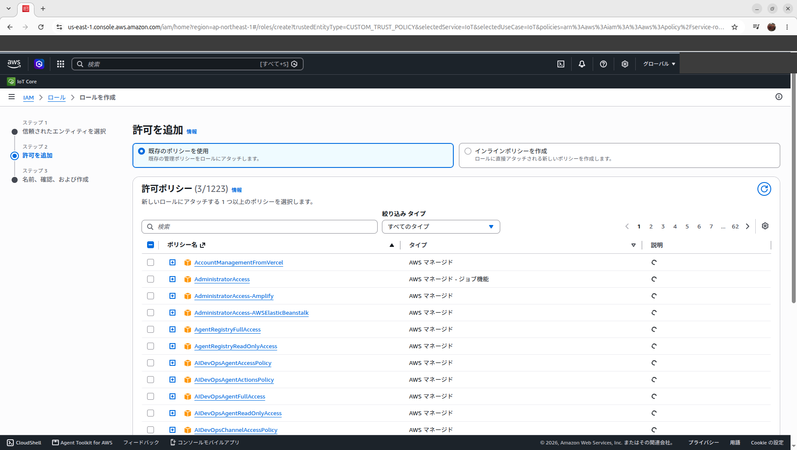</a>

#### 手順 3: 名前を付けて作成する

ロール名を `thermo-iot-cloudwatch` にして、画面の下の「ロールを作成」を押します。

<a href="assets/aws-iam-04-role-name.png">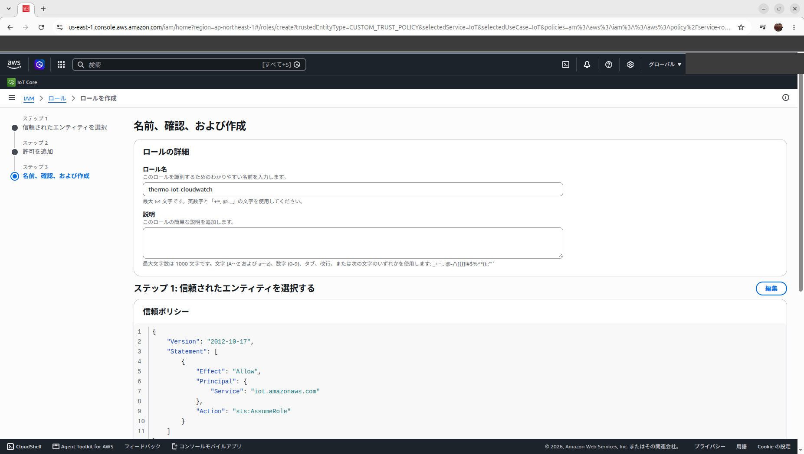</a>

ロールの一覧に、`thermo-iot-cloudwatch` (信頼されたエンティティ: `AWS のサービス: iot`) が、できます。

<a href="assets/aws-iam-05-role-created.png">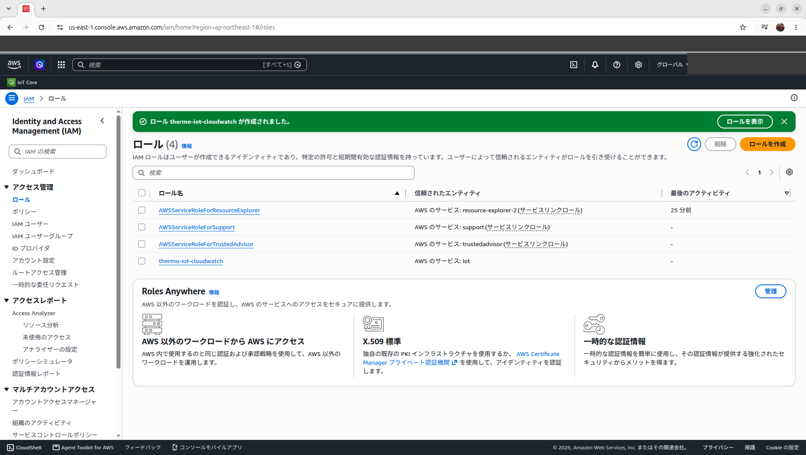</a>

#### 手順 4: インラインポリシーを追加する

作ったロールを開いて、「許可」のタブの「許可を追加」から、「インラインポリシーを作成」を選びます。

<a href="assets/aws-iam-06-add-inline-policy.png">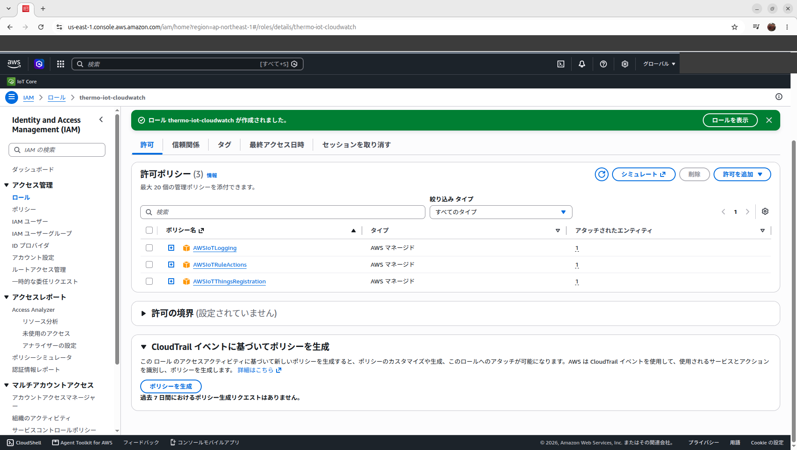</a>

「ポリシーエディタ」の「JSON」のタブに、上の `perm.json` の中身を貼り付けて、「次へ」を押します。

<a href="assets/aws-iam-07-policy-json.png">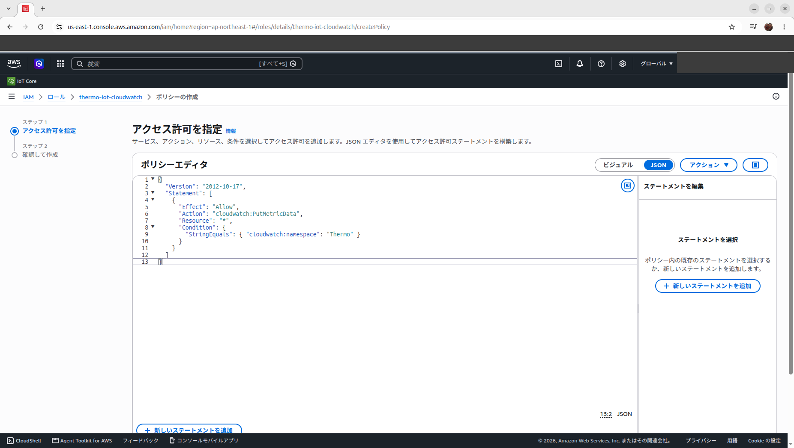</a>

ポリシー名を `put-metric` にします。「このポリシーで定義されている許可」に、「CloudWatch / 制限あり: 書き込み / すべてのリソース / `cloudwatch:namespace = Thermo`」と出ていることを確認して、「ポリシーの作成」を押します。

<a href="assets/aws-iam-08-policy-name.png">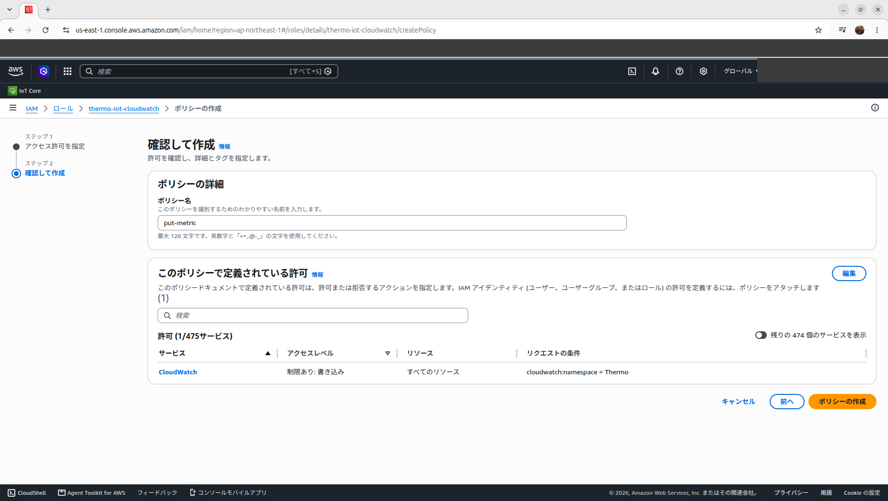</a>

#### 手順 5: ARN を控える

ロールの画面の「概要」の「ARN」(`arn:aws:iam::<アカウント ID>:role/thermo-iot-cloudwatch`) を、控えます。4.3 の `roleArn` に使います。

「許可ポリシー」には、`put-metric` (カスタマーインライン) だけがあれば、よいです。

<a href="assets/aws-iam-09-role-arn.png">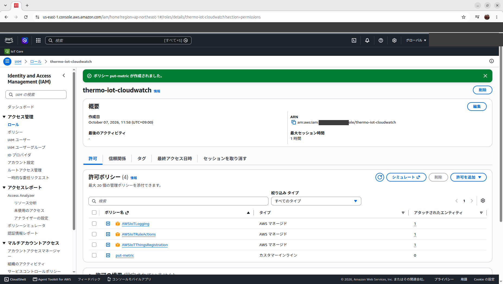</a>

#### 手順 1 で「IoT」を選んでしまった場合

次の 3 つの管理ポリシーが、付いたままになっています。ロールの画面の「許可」のタブで、この 3 つを選んで、「削除」(ロールから外す。ポリシー自体は、消えません) を押してください。

- `AWSIoTLogging`
- `AWSIoTRuleActions`
- `AWSIoTThingsRegistration`

`put-metric` だけを、残します。

## 4. ルールを作る

### 4.1 受け取る値

SwitchBot のメッセージ ([AWS_SETUP.md](AWS_SETUP.md) の 1.2) は、次の形です。

```json
{"node":"ED:2E:C4:46:3B:11","type":"switchbot","temperature_c":21.8,"humidity":54,"battery":100,"uptime_ms":223966,"timestamp":1791338131}
```

ルールの SQL で、`temperature_c`、`humidity`、`battery` を取り出して、それぞれ別のメトリクスにします。

### 4.2 メトリクスの名前

CloudWatch のメトリクスは、「名前空間」(`Thermo`) と「メトリクス名」で決まります。ルールからは、ディメンション (機器を区別する付加情報) を付けられないので、**機器の MAC アドレスを、メトリクス名に入れます**。

| メトリクス名 | 意味 |
|:---|:---|
| `ED:2E:C4:46:3B:11_temperature_c` | 温度 [℃] |
| `ED:2E:C4:46:3B:11_humidity` | 湿度 [%] |
| `ED:2E:C4:46:3B:11_battery` | 電池残量 [%] |

MAC アドレスは、トピックの 4 番目の要素 (`thermo/gateway-01/switchbot/ED:2E:...`) です。ルールでは、`${topic(4)}` で取り出します。

### 4.3 ルールを作る

```bash
cat > rule.json <<'JSON'
{
  "sql": "SELECT temperature_c, humidity, battery FROM 'thermo/+/switchbot/+'",
  "awsIotSqlVersion": "2016-03-23",
  "ruleDisabled": false,
  "actions": [
    {
      "cloudwatchMetric": {
        "roleArn": "arn:aws:iam::ACCOUNT_ID:role/thermo-iot-cloudwatch",
        "metricNamespace": "Thermo",
        "metricName": "${topic(4)}_temperature_c",
        "metricValue": "${temperature_c}",
        "metricUnit": "None"
      }
    },
    {
      "cloudwatchMetric": {
        "roleArn": "arn:aws:iam::ACCOUNT_ID:role/thermo-iot-cloudwatch",
        "metricNamespace": "Thermo",
        "metricName": "${topic(4)}_humidity",
        "metricValue": "${humidity}",
        "metricUnit": "Percent"
      }
    },
    {
      "cloudwatchMetric": {
        "roleArn": "arn:aws:iam::ACCOUNT_ID:role/thermo-iot-cloudwatch",
        "metricNamespace": "Thermo",
        "metricName": "${topic(4)}_battery",
        "metricValue": "${battery}",
        "metricUnit": "Percent"
      }
    }
  ]
}
JSON

aws iot create-topic-rule --rule-name thermo_switchbot_to_cloudwatch \
  --topic-rule-payload file://rule.json
```

- `ACCOUNT_ID` は、自分のアカウント ID に置き換えます。
- `'thermo/+/switchbot/+'` の `+` は、1 つの階層に合う、ワイルドカードです。ゲートウェイの ID (`gateway-01`) と、SwitchBot の MAC アドレスの、どれにも合います。
- `metricTimestamp` を指定しないと、メッセージを受け取った時刻が、使われます (ゲートウェイの時刻 `timestamp` は、SNTP が合っていないと、入らないので、使いません)。
- 電池残量が、わからないとき (`battery` を出力しないとき) は、その値のルールは、実行されず、`battery` のメトリクスだけが、欠けます。
### 4.4 コンソールで作る場合

画面は、2026 年 10 月のものです。変わることがあります。画像は、クリックすると、元の大きさで開きます。

#### 手順 1: ルールのプロパティ

「IoT Core → メッセージのルーティング → ルール」を開いて、「ルールを作成」を押します。リージョンが、`アジアパシフィック (東京)` になっていることを、確認してください。

<a href="assets/aws-rule-01-rule-list.png">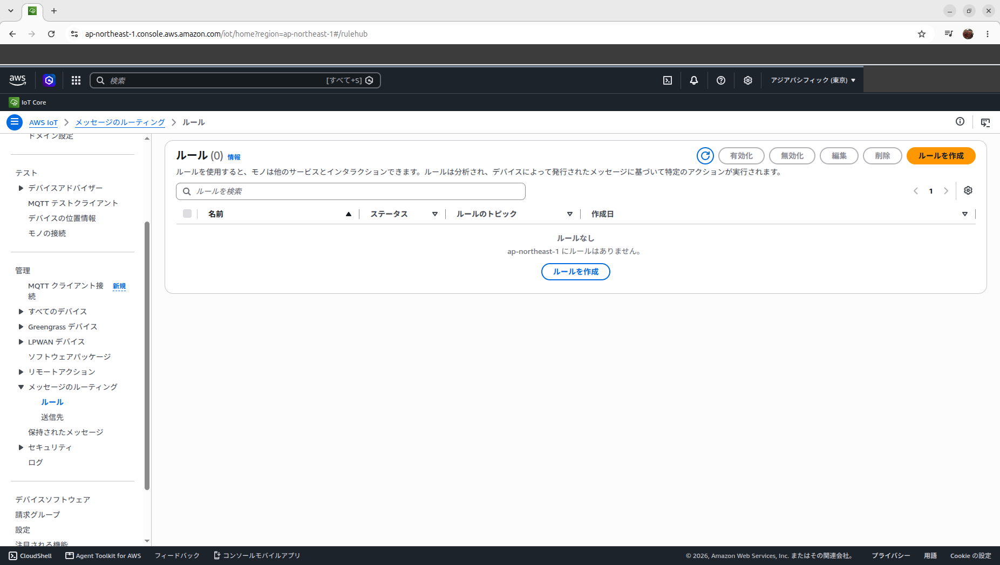</a>

ルール名を `thermo_switchbot_to_cloudwatch` にします (英数字とアンダースコアだけ。スペースとハイフンは、使えません)。説明 (例: `SwitchBot の値を CloudWatch のメトリクスにする`) は、空でも構いません。タグは、不要です。「次へ」を押します。

<a href="assets/aws-rule-02-properties.png">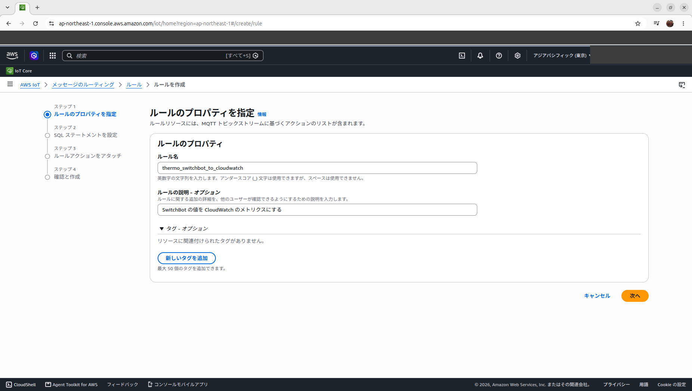</a>

#### 手順 2: SQL ステートメント

SQL のバージョンは、`2016-03-23` にします。SQL ステートメントに、次の 1 行を入れて、「次へ」を押します。

```sql
SELECT temperature_c, humidity, battery FROM 'thermo/+/switchbot/+'
```

<a href="assets/aws-rule-03-sql.png">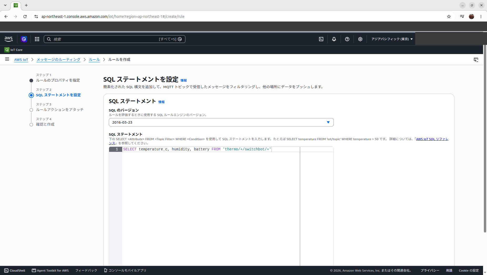</a>

ブラウザの入力欄に貼ると、シングルクォート (`'`) が、全角に変わることがあります。変わったときは、半角で、入力し直してください。

#### 手順 3: ルールアクション

アクションを、3 つ追加します。どれも、アクションの種類は、「**CloudWatch metric**」(CloudWatch メトリクスにメッセージデータを送信) です。入力欄は、次のとおりです。

| 入力欄 | アクション 1 (温度) | アクション 2 (湿度) | アクション 3 (電池) |
|:---|:---|:---|:---|
| メトリクス名 | `${topic(4)}_temperature_c` | `${topic(4)}_humidity` | `${topic(4)}_battery` |
| メトリクス名前空間 | `Thermo` | `Thermo` | `Thermo` |
| 単位 | `None` | `Percent` | `Percent` |
| 値 | `${temperature_c}` | `${humidity}` | `${battery}` |
| タイムスタンプ (オプション) | 空 | 空 | 空 |
| IAM ロール | `thermo-iot-cloudwatch` | 同じ | 同じ |

- `${...}` は、そのまま入力します。メッセージが届いたときに、値に置き換わります。
- **メトリクス名の前後に、空白を入れないでください。** 先頭に空白が入ると、`" ED:2E:C4:46:3B:11_humidity"` のように、空白付きの名前のメトリクスが、できてしまいます (貼り付けのときに、入りやすいです)。直すときは、ルールのアクションの、メトリクス名を編集します。
- IAM ロールは、プルダウンから選びます (3 章で作ったロール)。

<a href="assets/aws-rule-04-action.png">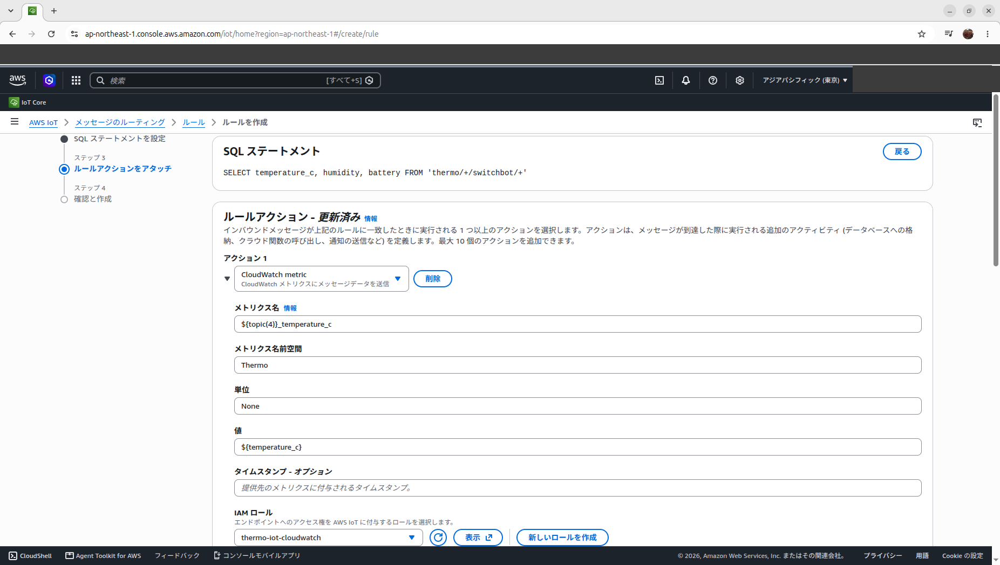</a>

アクション 1 の画面です。上に、手順 2 の SQL が、表示されています。アクション 2 と 3 も、同じように、追加して、「次へ」を押します。

#### 手順 4: 確認と作成

手順 1 から 3 の内容 (ルール名、SQL、3 つのアクション) を、確認して、画面の下の「作成」を押します。

<a href="assets/aws-rule-05-review.png">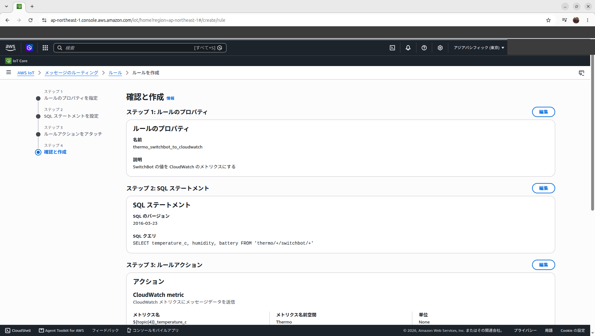</a>

#### 手順 5: 作成できたことの確認

「ルール `thermo_switchbot_to_cloudwatch` は正常に作成されました。」と出て、次のようになっていれば、完了です。

- ステータス: **アクティブ**
- トピック: `thermo/+/switchbot/+`
- アクション (3): `CloudWatch metric` が 3 つ

<a href="assets/aws-rule-06-created.png">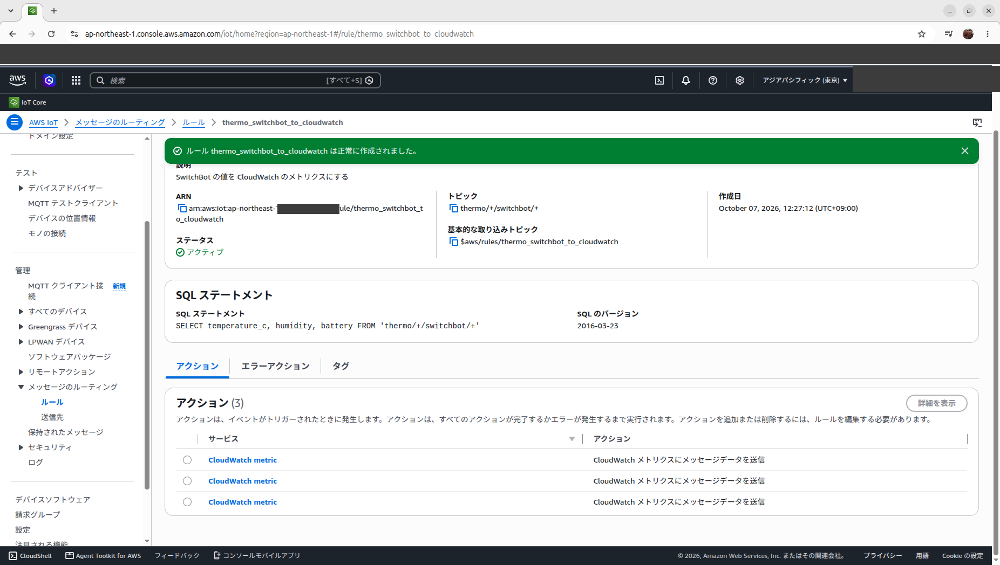</a>

次は、5 章で、データが届いているか、確認します。

## 5. データが届いているか確認する

1. ゲートウェイを起動して、1〜2 分待ちます (`Connected to AWS IoT Core` が、ログに出ていること)。
2. 次のコマンドで、メトリクスができたか確認します。

   ```bash
   aws cloudwatch list-metrics --namespace Thermo
   ```

   `ED:2E:C4:46:3B:11_temperature_c` など、3 つのメトリクスが、出るはずです (最初の値から、数分かかることがあります)。

3. 直近の値を見ます。

   ```bash
   aws cloudwatch get-metric-statistics --namespace Thermo \
     --metric-name "ED:2E:C4:46:3B:11_temperature_c" \
     --start-time "$(date -u -d '30 minutes ago' +%Y-%m-%dT%H:%M:%SZ)" \
     --end-time "$(date -u +%Y-%m-%dT%H:%M:%SZ)" \
     --period 300 --statistics Average
   ```

- コンソール: 「CloudWatch → メトリクス → すべてのメトリクス」で、名前空間 `Thermo` を選びます。

## 6. グラフ (ダッシュボード) を作る

### 6.1 コンソールで作る

画面は、2026 年 10 月のものです。変わることがあります。画像は、クリックすると、元の大きさで開きます。

#### 手順 1: ダッシュボードを作る

「CloudWatch → ダッシュボード」を開きます。リージョンが、`アジアパシフィック (東京)` になっていることを、確認してください。「ダッシュボードの作成」を押します。

<a href="assets/aws-dash-01-list.png">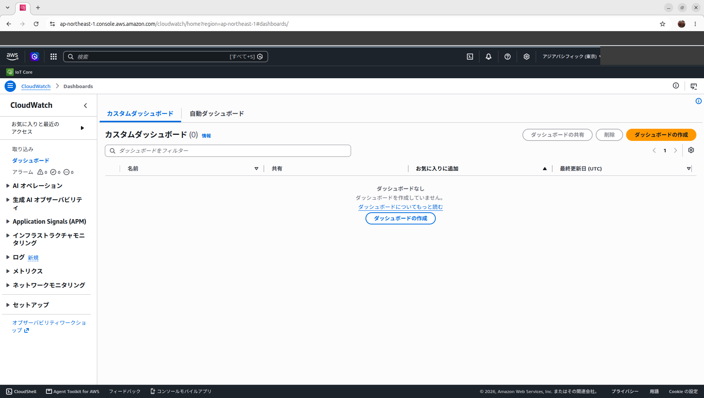</a>

ダッシュボード名を `thermo` にして、「ダッシュボードの作成」を押します (名前に使えるのは、英数字、ハイフン、アンダースコアです)。

<a href="assets/aws-dash-02-name.png">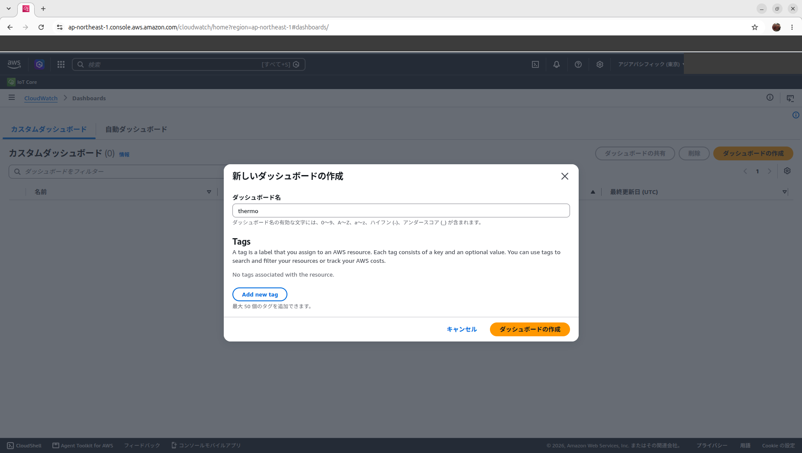</a>

#### 手順 2: ウィジェット (グラフ) を追加する

「ウィジェットの追加」の画面が出ます。データソースタイプは「Cloudwatch」、データ型は「メトリクス」、ウィジェットのタイプは「**線**」を選んで、「次へ」を押します。

<a href="assets/aws-dash-03-widget-type.png">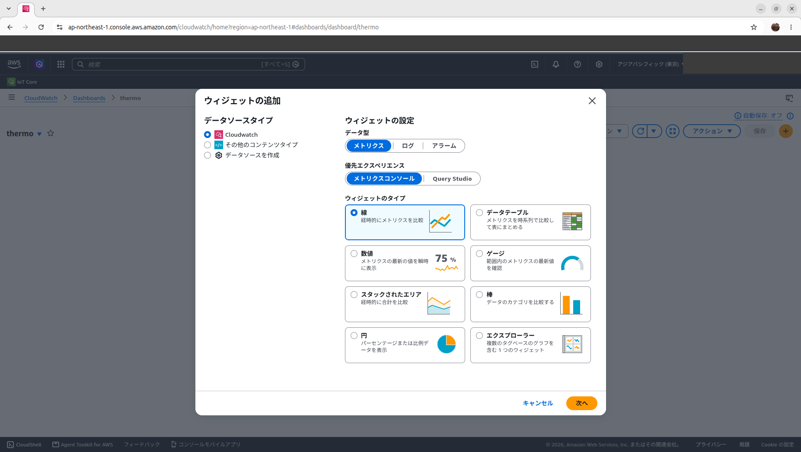</a>

#### 手順 3: メトリクスを選ぶ

「メトリクスグラフの追加」の画面です。「カスタム名前空間」の「**Thermo**」を押して、「ディメンションなしのメトリクス」を押すと、メトリクスの一覧が出ます。

<a href="assets/aws-dash-04-metrics.png">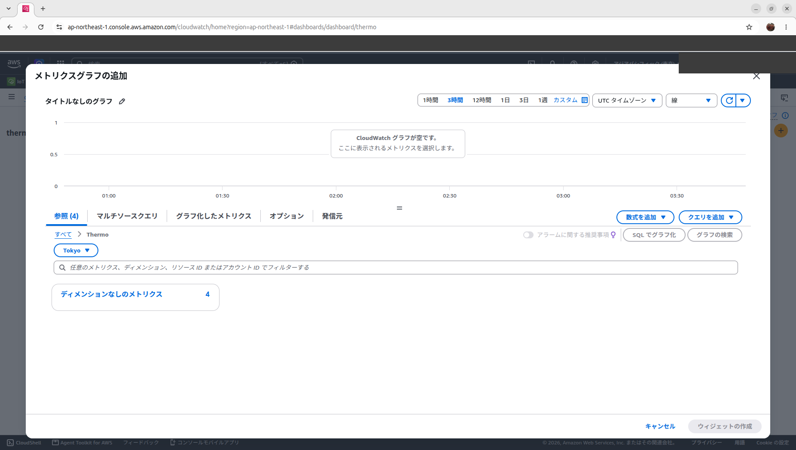</a>

一覧には、`ED:2E:C4:46:3B:11_humidity` が、**2 つ**出ることがあります。メトリクス名の先頭に、空白が入っていた古いもの (一覧の最初の行) と、空白のない新しいものです (8 章を参照)。**空白のないほうを選びます** (古いものは、新しい値が入りません)。

1 つ目のウィジェットは、湿度 (`ED:2E:C4:46:3B:11_humidity`) の、チェックボックスを押します。グラフが、画面の上に、出ます。「ウィジェットの作成」を押します。

<a href="assets/aws-dash-05-humidity.png">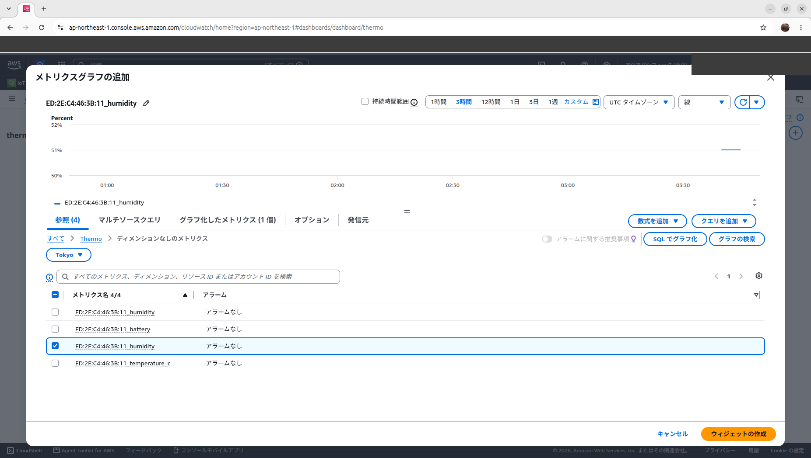</a>

温度 (`ED:2E:C4:46:3B:11_temperature_c`)、電池残量 (`ED:2E:C4:46:3B:11_battery`) も、同じように、1 つずつ、ウィジェットにします (画面の右上の「+」で、ウィジェットを追加します)。温度と湿度は、単位が違うので、別のウィジェットにします。

#### 手順 4: 保存する

3 つのウィジェットが、並びます。画面の右上に「**自動保存: オフ**」と出ています。右上の橙色の「**保存**」ボタンを押してください。押さないと、画面を閉じたときに、ダッシュボードが消えます。

<a href="assets/aws-dash-06-three-widgets.png">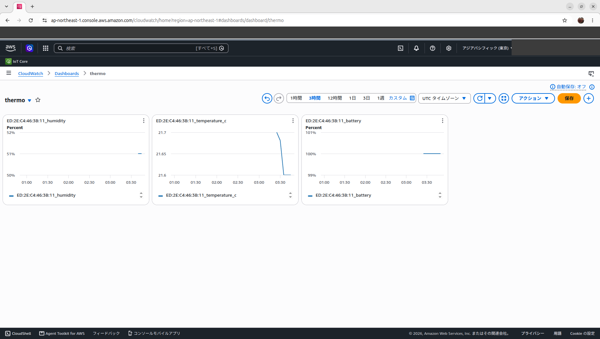</a>

#### 手順 5: 期間と統計を変える (必要なときだけ)

何も変えなければ、**統計は「平均 (Average)」、期間は「5 分」**です。今回は、このままで構いません。変えるときは、ウィジェットごとに、次のようにします。

1. ウィジェット右上の「⋮」を押して、「編集」を選びます。
2. 「グラフの編集」の画面で、「**グラフ化したメトリクス**」のタブを開きます。
3. 次のどちらかで、変えます。
   - **メトリクスの行の「統計」と「期間」**: その 1 つのメトリクスだけが、変わります。プルダウンで、`平均`、`最小`、`最大`、`合計` などと、`1 分`、`5 分`、`1 時間` などを、選びます。
   - **画面の右上の「統計:」と「期間:」**: ウィジェットの、すべてのメトリクスに、まとめて、適用します。
4. 画面の右下の「**ウィジェットの更新**」を押します。

<a href="assets/aws-dash-08-edit-period-stat.png">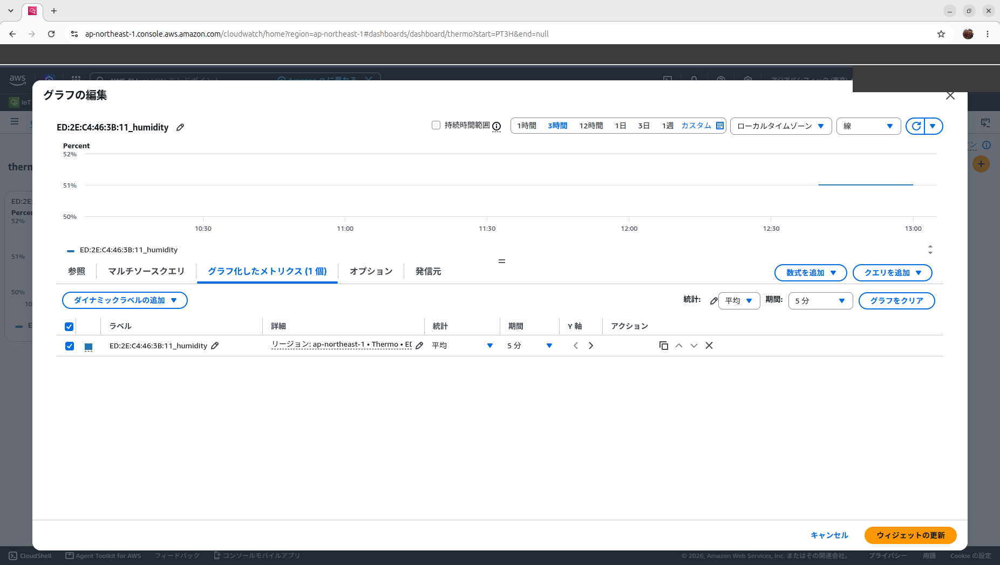</a>

- 期間の最小は、1 分です。ゲートウェイは、10 秒ごとに送りますが、CloudWatch は、期間の中の値を、まとめます (平均なら、5 分の平均)。
- 温度のゆらぎを、細かく見たいときは、期間を「1 分」にします。電池残量のように、ゆっくり変わるものは、「1 時間」で、十分です。

**画面全体の表示範囲と時刻**

ダッシュボードの右上の、`1時間` `3時間` `12時間` `1日` `3日` `1週` のボタンで、表示する時間の範囲を、変えます。すぐ右の「UTC タイムゾーン」を、「**ローカルタイムゾーン**」に変えると、時刻が、日本時間 (UTC+09:00) で、表示されます。

<a href="assets/aws-dash-07-dashboard-local-time.png">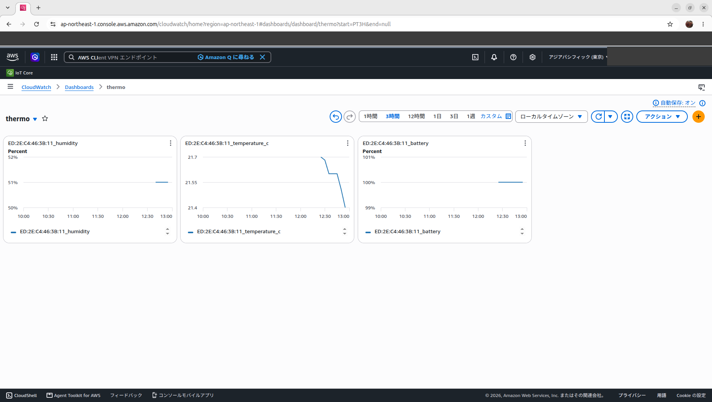</a>

右上に、「自動保存」の表示があります。「オフ」のときは、変更のたびに、「保存」を押します。「オン」にすると、変更が、自動で、保存されます。

### 6.2 CLI で作る

```bash
cat > dashboard.json <<'JSON'
{
  "widgets": [
    {
      "type": "metric", "x": 0, "y": 0, "width": 12, "height": 6,
      "properties": {
        "title": "Temperature [C]",
        "region": "ap-northeast-1",
        "metrics": [ [ "Thermo", "ED:2E:C4:46:3B:11_temperature_c" ] ],
        "stat": "Average", "period": 300, "view": "timeSeries"
      }
    },
    {
      "type": "metric", "x": 12, "y": 0, "width": 12, "height": 6,
      "properties": {
        "title": "Humidity [%]",
        "region": "ap-northeast-1",
        "metrics": [ [ "Thermo", "ED:2E:C4:46:3B:11_humidity" ] ],
        "stat": "Average", "period": 300, "view": "timeSeries"
      }
    },
    {
      "type": "metric", "x": 0, "y": 6, "width": 12, "height": 6,
      "properties": {
        "title": "Battery [%]",
        "region": "ap-northeast-1",
        "metrics": [ [ "Thermo", "ED:2E:C4:46:3B:11_battery" ] ],
        "stat": "Average", "period": 3600, "view": "timeSeries"
      }
    }
  ]
}
JSON

aws cloudwatch put-dashboard --dashboard-name thermo \
  --dashboard-body file://dashboard.json
```

- 機器 (MAC アドレス) を足すときは、`metrics` に、`[ "Thermo", "<MAC>_temperature_c" ]` の行を足します。ルールは、変えなくて済みます (`+` で、すべての機器に合うため)。
- `period` は、秒です。10 秒ごとに届いても、CloudWatch は、1 分の単位で、集計します (最小は 60)。

## 7. これから

### 7.1 アラーム (しきい値を超えたら、通知する)

CloudWatch のアラームを、メトリクスに付けられます (例: 温度が 30 ℃ を超えたら、メールを送る)。通知先 (SNS のトピック) を、作る必要があります。コンソールの「CloudWatch → アラーム → アラームの作成」から、できます。ゲートウェイが、止まったことの検出 (データが来ない) は、アラームの「欠測データの処理」を、「不良 (しきい値違反)」にします。

### 7.2 Thermo ノードの温度

ノードの値は、ADC の生値 (`raw`、0〜4095) で、℃ に変換していません ([AWS_SETUP.md](AWS_SETUP.md) の 1.1)。ルールの SQL で、変換式を書いて、グラフにできます (センサの型番が決まってから、決めます)。ノードの実機がないので、この手順では、扱いません。

### 7.3 細かいデータを残す・分析する

| 方法 | 向いていること |
|:---|:---|
| IoT ルール → S3 (JSON) → Athena | 10 秒ごとの、すべてのデータを、安く残して、SQL で分析する |
| IoT ルール → DynamoDB | 最新の値を、すぐ読み出す。ほかのアプリから使う |
| Amazon Managed Grafana (+ CloudWatch) | 見た目や、複数のデータの組み合わせを、自由に作る |

## 8. うまくいかないとき

| 症状 | 確認すること |
|:---|:---|
| メトリクスが、できない | MQTT テストクライアントで、`thermo/#` に、メッセージが届いているか。ルールの SQL のトピック (`thermo/+/switchbot/+`) が、合っているか |
| `list-metrics` が、空 | 数分待つ。リージョンが、ルールを作ったところと、同じか (`--region` を付ける) |
| ルールが、動かない | 「IoT Core → ルール」で、ルールが「有効」か。「IoT Core → 設定 → ログ」で、ログを有効にして、CloudWatch Logs の `AWSIotLogsV2` で、エラーを確認する |
| 権限のエラー (`AccessDenied`) | ロールの信頼ポリシーが、`iot.amazonaws.com` か。権限ポリシーの名前空間が、`Thermo` か |
| メトリクス名の先頭に、空白がある (`" ED:..."`) | ルールのアクションの、メトリクス名の先頭の空白を、消す (4.4 の手順 3)。古い名前のメトリクスは、残るが、新しい値は入らなくなる |
| 電池残量だけ、ない | メッセージに、`battery` が入っているか (残量が不明なときは、入りません) |
| 値が、1 分ごとにしか、変わらない | CloudWatch の最小の期間は、1 分です。正常です |

## 9. 料金の目安

料金は、リージョンと時期で変わります。最新の料金表で、確認してください。

- **IoT Core のルール**: メッセージ 1 通で、ルールの実行が 1 回、アクションが 3 回です。10 秒に 1 通だと、1 日に 8,640 通 (アクション約 26,000 回)、1 か月で約 78 万回です。
- **CloudWatch**: カスタムメトリクス 1 つ (機器あたり 3 つ) と、ダッシュボード (3 つまで無料枠) が、対象です。メトリクスは、10 個までが、無料枠です (無料枠の条件は、変わることがあります)。

使わなくなったときは、課金が続かないように、ルール (`aws iot delete-topic-rule --rule-name thermo_switchbot_to_cloudwatch`)、ダッシュボード、アラームを削除してください。
