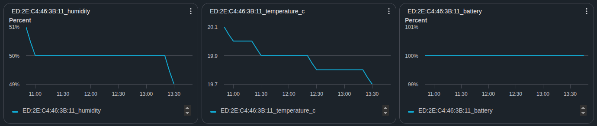

# esp32-thermo-system

Zephyr RTOS-based BLE thermometer system featuring a sensor node and a gateway for Seeed Studio XIAO ESP32C3.

## 概要

このプロジェクトは、ESP32C3 マイクロコントローラ上で Zephyr RTOS を使用したBLE（Bluetooth Low Energy）サーモメータシステムです。

- **Thermo Node**: 温度センサを備えたエッジノード。温度データを BLE 経由で配信
- **Thermo Gateway**: 複数のノードから温度データを収集・集約するゲートウェイ

## プロジェクト構成

```
esp32-thermo-system/
├── app/
│   ├── thermo-node/      # センサノードアプリケーション
│   │   ├── CMakeLists.txt
│   │   ├── prj.conf      # Zephyr 設定
│   │   └── src/          # ソースコード
│   └── thermo-gateway/   # ゲートウェイアプリケーション
│       ├── CMakeLists.txt
│       ├── prj.conf
│       └── src/
├── .github/workflows/    # CI/CD パイプライン
├── west.yml              # West マニフェスト
├── SETUP.md              # セットアップガイド
└── README.md             # このファイル
```

## クイックスタート

### シミュレーション（推奨・最速）

ハードウェアなしで Linux PC 上でテストしたい場合：

```bash
# ビルド
docker compose run --rm build-thermo-node-sim
docker compose run --rm build-thermo-gateway-sim

# 実行
./build/thermo-node-sim/zephyr/zephyr.exe &
./build/thermo-gateway-sim/zephyr/zephyr.exe
```

詳細は [SIMULATION.md](./SIMULATION.md) を参照してください。

### Docker を使用したビルド

Docker と Docker Compose がインストールされている場合、最も簡単な方法です：

```bash
# Thermo Node をビルド（ESP32C3用）
docker compose run --rm build-thermo-node

# Thermo Gateway をビルド（ESP32C3用）
docker compose run --rm build-thermo-gateway

# Thermo Node をビルド（シミュレーション）
docker compose run --rm build-thermo-node-sim

# Thermo Gateway をビルド（シミュレーション）
docker compose run --rm build-thermo-gateway-sim

# インタラクティブ開発シェル
docker compose run --rm dev

# 生成物 (build/ と docs/) を全て消す (次のビルドは、最初からやり直す)
docker compose run --rm clean
```

### 単体テストと静的解析

単体テストは Zephyr の Ztest と FFF (モック) で書かれていて、`native_sim` 上で実行します (`app/thermo-node/tests/` と `app/thermo-gateway/tests/`)。

```bash
# 単体テスト (Thermo Node / Thermo Gateway)
docker compose run --rm test-thermo-node
docker compose run --rm test-thermo-gateway
# カバレッジ (行と分岐が 100% でなければ失敗する)
docker compose run --rm coverage-thermo-node
docker compose run --rm coverage-thermo-gateway
# ドキュメント (Doxygen。docs/index.html を開く。警告があれば失敗する)
docker compose run --rm docs-thermo

# 静的解析 (gcc -fanalyzer。指摘があれば失敗する)
docker compose run --rm analyze-thermo-node
docker compose run --rm analyze-thermo-gateway
```

### 整形と lint

コーディングスタイルは Zephyr の規約に合わせています (違う点は [CODING_STYLE.md](CODING_STYLE.md))。

```bash
# 整形の確認 (整形が必要なら失敗する)
docker compose run --rm format-thermo
# 整形して、ファイルを書き換える
docker compose run --rm format-thermo-fix
# Zephyr の checkpatch.pl による検査
docker compose run --rm lint-thermo
# 行末の空白の確認 (全てのテキストファイル)
docker compose run --rm whitespace-thermo
```

### ローカル開発環境構築

Docker を使用しない場合は、[SETUP.md](./SETUP.md) を参照してください。

```bash
# West ワークスペース初期化
west init -l .

# Thermo Node をビルド（ESP32C3用）
west build -b xiao_esp32c3 app/thermo-node

# Thermo Gateway をビルド（ESP32C3用）
west build -b xiao_esp32c3 app/thermo-gateway

# Thermo Node をビルド（シミュレーション）
west build -b native_sim/native/64 app/thermo-node -d build/thermo-node-sim -- -DCONF_FILE=prj-native_sim.conf

# Thermo Gateway をビルド（シミュレーション）
west build -b native_sim/native/64 app/thermo-gateway -d build/thermo-gateway-sim -- -DCONF_FILE=prj-native_sim.conf
```

### デバッグログ

`LOG_DBG` と `LOG_HEXDUMP_DBG` (BLE で送受信したデータの 16 進ダンプ) は、通常のビルドでは、コードごと消えます。有効にするときは、cmake のオプション `THERMO_DEBUG_LOG` を `ON` にして、ビルドします。
アプリのソース (`app/thermo-*/src/`) だけに、`THERMO_LOG_LEVEL=4` (DBG) が付きます (`app/common/thermo_log.h`)。Zephyr のモジュール (Bluetooth、ネットワーク、mbedTLS など) は、`CONFIG_LOG_DEFAULT_LEVEL` (3) のままです。全体を DBG にすると、ログの量が多すぎて、スタックが足りなくなり、動かなくなるためです。Zephyr のモジュールのログが必要なときは、`-DCONFIG_NET_LOG=y -DCONFIG_NET_SOCKETS_LOG_LEVEL_ERR=y` などを、個別に足してください ([AWS_SETUP.md](AWS_SETUP.md) の 5.1 を参照)。

```bash
# Docker: 環境変数 THERMO_DEBUG_LOG を ON にして、build-* のサービスを実行する (既定は OFF)
THERMO_DEBUG_LOG=ON docker compose run --rm build-thermo-node
THERMO_DEBUG_LOG=ON docker compose run --rm build-thermo-gateway

# West (Docker を使わない場合)
west build -p always -b xiao_esp32c3 app/thermo-node -- -DTHERMO_DEBUG_LOG=ON
```

gateway がスキャンで受け取る広告データの 16 進ダンプは、大量に届くので、50 要素に 1 回だけ出します (`app/thermo-gateway/src/ble.c` の `ADV_HEXDUMP_EVERY`。`THERMO_DEBUG_LOG=ON` のときだけ有効)。

ログの読み方 (16 進ダンプの見方、SwitchBot の受信から AWS への送信までの流れ) は、[DEBUG_LOG.md](DEBUG_LOG.md) を参照してください。

設定を切り替えるときは、前のビルドが残っていると、反映されないことがあるので、ビルドのディレクトリ (`build/thermo-node` など) を削除してから、ビルドし直します (west は `-p always`)。

### フラッシング

```bash
# ビルド後、USB で接続した状態で実行
# XIAO ESP32C3 は USB を内蔵しているので、ポートは /dev/ttyACM0 (macOS は /dev/tty.usbmodem*)
esptool -p /dev/ttyACM0 write-flash 0x0 build/thermo-gateway/zephyr/zephyr.bin

# スクリプト (TARGET は node / gateway。PORT の既定値は /dev/ttyACM0。2 台つなぐときは、台ごとに PORT を指定する)
scripts/flash.sh gateway /dev/ttyACM0
```

## 機能

### Thermo Node
> **実機での確認は、まだしていません** (Thermo ノードの実機がありません)。単体テスト (偽のセンサ、ADC エミュレータ、FFF のモック) と、`native_sim` のシミュレーションだけで確認しています。

- 温湿度センサ (DHT11) の読取 (Zephyr のセンサ API。配線は [SETUP.md](SETUP.md) の「Thermo ノードのセンサ」)。ADC のアナログセンサ (LM35 など) にも、Devicetree の書き換えで、替えられます
- BLE GATT サービスで、温度と湿度のデータを配信
- 拡張ボードの OLED に、温度、湿度、日付、時刻と、温度と湿度のグラフ (直近の約 64 分) を表示 (ユーザボタンでページを切り替え)。時刻は、拡張ボードの RTC (PCF8563) から読みます (RTC は、ゲートウェイから BLE で受け取った時刻に合わせます) (設定は [SETUP.md](SETUP.md) の「OLED の表示と時刻」。`THERMO_DISPLAY=n` と `THERMO_RTC=n` で、別々に外せます)
- 起動のときに、OLED に、約 3 秒の起動画面 (丸い絵が、ドットを食べながら走る) を出して、ブザーで、短いメロディを鳴らす (オリジナルの絵と曲。差し替えは、[SETUP.md](SETUP.md) の「起動画面と起動音」)
- ログ出力（UART シリアルコンソール）

### Thermo Gateway
- BLE スキャンで周辺ノードを検出して、GATT で接続し、温度と湿度の通知を受信 (最大 3 台。ノードの実機がないので、実機では未確認)
- SwitchBot 屋外用温湿度計 (Outdoor Meter) のアドバタイズ (接続しない) を受信して、温度 (℃)・湿度・電池残量を、10 秒に 1 回、AWS IoT Core に送信
- WiFi + MQTT (TLS、クライアント証明書による相互認証) で、AWS IoT Core に温度を送信 (設定手順は [AWS_SETUP.md](AWS_SETUP.md)。届いたデータをグラフにする手順は [AWS_GRAPH.md](AWS_GRAPH.md)。DynamoDB に保存して、アプリから読む手順は [AWS_DYNAMODB.md](AWS_DYNAMODB.md))
- SNTP で同期した時刻を、接続したノードに BLE (GATT の書き込み) で渡して、ノードの RTC を合わせる (1 時間ごと。[SETUP.md](SETUP.md) の「ゲートウェイからの時刻の同期」)
- WiFi・エンドポイント・証明書は、シェルの `thermo` コマンドで設定して、フラッシュに保存
- デバッグシェル対応

AWS IoT Core に届いた SwitchBot のデータを、CloudWatch のダッシュボードに表示した例です (左から、湿度、温度、電池残量。画像をクリックすると、拡大します)。

<a href="assets/aws-dashboard-thermo.png"></a>

### 実機での動作確認の状況

実機 (XIAO ESP32C3) は、Thermo Gateway の 1 台だけです。Thermo ノードの実機がないので、**確認できているのは、SwitchBot の受信と、AWS IoT Core への送信まで**です。

| 項目 | 実機での確認 |
|:---|:---|
| SwitchBot 屋外用温湿度計の受信 (温度・湿度・電池残量) | 済み (SwitchBot のアプリの値と一致) |
| WiFi、SNTP、TLS (相互認証)、MQTT で AWS IoT Core に接続 | 済み (外付けアンテナあり) |
| SwitchBot の値が AWS IoT Core に届く (10 秒に 1 回) | 済み |
| Thermo ノード (DHT11 の読取、BLE の配信、OLED の表示、RTC の時刻) | **未確認** (実機が、届き次第、確認する) |
| ゲートウェイが、ノードに GATT で接続して、温度を受信する | **未確認** (実機がない) |
| ノードの温度が AWS IoT Core に届く | **未確認** (実機がない) |

## 対応ハードウェア

- **MCU**: ESP32C3
- **開発ボード**: Seeed Studio XIAO ESP32C3
- **通信**: BLE 5.0

## CI/CD

GitHub Actions により、以下の自動化が設定されています：

- **ビルド** (`build` ジョブ): 実機 (ESP32C3) 用とシミュレーション (`native_sim`) 用の、両アプリのビルド。警告が出たら失敗します
- **単体テスト** (`test` ジョブ): Thermo Node / Thermo Gateway の単体テスト
- **静的解析** (`analyze` ジョブ): gcc `-fanalyzer`。指摘があれば失敗します
- **整形と lint** (`lint` ジョブ): clang-format による整形の確認、Zephyr の `checkpatch.pl`、行末の空白の確認。指摘があれば失敗します
- **アーティファクト保存**: ビルド成果物 (ELF/BIN、シミュレーションは実行ファイル) と、各ジョブのログを自動保存します。保存期間は 3 日で、`cleanup` ジョブが、3 日より前の実行 (ログと artifact) を、push のたびに削除します

ジョブは、ローカルと同じ Docker イメージで `docker compose` のサービスを実行します。イメージのレイヤーは、キャッシュされます。

## 開発フロー

1. `ccr-*` ブランチで機能開発
2. Push 時に GitHub Actions で、ビルド・単体テスト・静的解析・lint を自動実行
3. PR をマージする前に、全ジョブの成功を確認
4. main ブランチへのマージ

### rebase したあとの push

`git rebase` でコミットの履歴を書き換えたあとは、通常の `git push` は拒否されるので、次のコマンドで push します。

```bash
git push --force-with-lease --force-if-includes origin <ブランチ名>
```

- `--force` は使わない。リモートに、手元に取り込んでいないコミット (他の人や別の環境の push) があれば、push は失敗する。失敗したら、`git fetch` で取り込んでから、やり直す。
- push は、ユーザーに依頼されたときだけ行う (AI エージェントも同じ)。

## デバッグ

### シリアルコンソール接続

```bash
picocom -b 115200 /dev/ttyACM0

# リセットのたびに USB が切れるので, 起動のログを見るときは, つなぎ直しを繰り返す
while true; do picocom -b 115200 /dev/ttyACM0 --noinit --noreset; sleep 0.3; done
```

### Zephyr ログレベル

`prj.conf` で以下のように設定可能：

```conf
CONFIG_LOG_MODE_IMMEDIATE=y
CONFIG_LOG_DEFAULT_LEVEL=4  # DEBUG レベル
```

## トラブルシューティング

問題が発生した場合は、[SETUP.md](./SETUP.md) のトラブルシューティングセクションを参照してください。

## ライセンス

[LICENSE](./LICENSE) を参照してください。

## リンク

- [Zephyr Project](https://www.zephyrproject.org/)
- [ESP32C3 データシート](https://www.espressif.com/sites/default/files/documentation/esp32-c3_datasheet_en.pdf)
- [XIAO ESP32C3 Wiki](https://wiki.seeedstudio.com/xiao_esp32c3_getting_started/)
